# Darknet源码阅读
Darknet是一个较为轻型的完全基于C与CUDA的开源深度学习框架，其主要特点就是容易安装，没有任何依赖项（OpenCV都可以不用），移植性非常好，支持CPU与GPU两种计算方式。

更多信息（包括安装、使用）可以参考：[Darknet: Open Source Neural Networks in C](https://pjreddie.com/darknet/)

# 为什么要做这个？

我在阅读Yolo论文的时候对很多实现细节不太明白，但是所幸我找到了讲解Yolo源码的一些博客，工程，给了我很大的启发，所以我打算在他们的基础上从宏观和微观的角度来理解一下DarkNet并将笔记记录到这个工程里。

# DarkNet源码阅读之主线

## 关于分析主线的确定

darknet相比当前训练的c/c++主流框架来讲，具有编译速度快，依赖少，易部署等众多优点，我们先定位到examples/darknet.c的main函数，这是这个框架实现分类，定位，回归，分割等功能的初始入口。

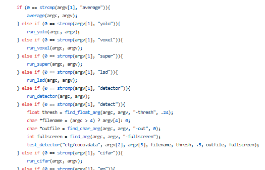

## 目标检测-run_detector

我们这里主要来分析一下目标检测，也就是examples/detector.c中的run_detector函数。可以看到这个函数主要包括了训练-测试-验证三个阶段。

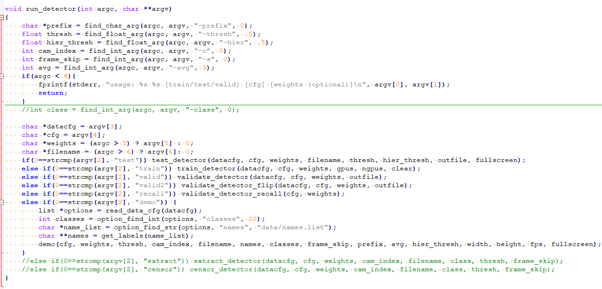

## 训练检测器-train_detector

由于训练，验证和测试阶段代码几乎是差不多的，只不过训练多了一个反向传播的过程。所以我们主要分析一下训练过程，训练过程是一个比较复杂的过程，不过宏观上大致分为解析网络配置文件，加载训练样本图像和labels，开启训练，结束训练保存模型这样一个过程，整体代码如下：

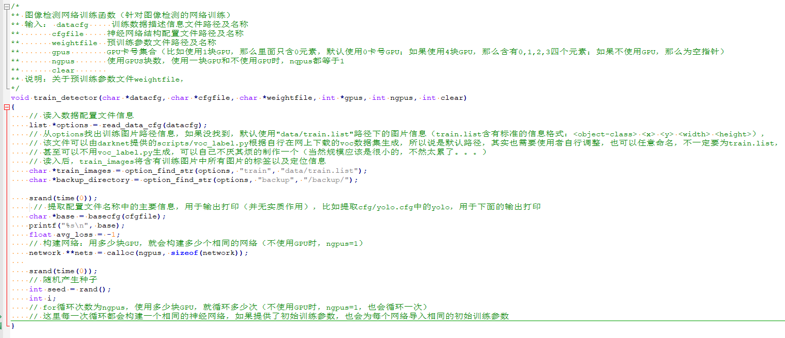

## 解析配置文件(.cfg)

### 配置文件长啥样？

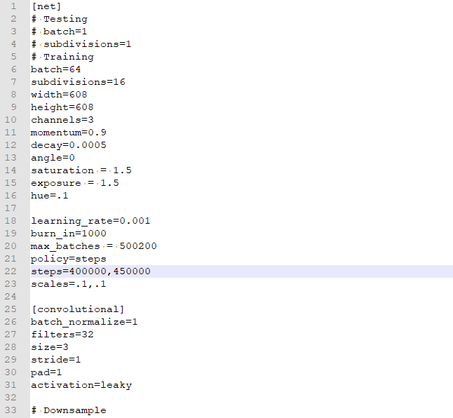

可以看到配置参数大概分为2类：

- 与训练相关的项，以 [net] 行开头的段. 其中包含的参数有: `batch_size, width,height,channel,momentum,decay,angle,saturation, exposure,hue,learning_rate,burn_in,max_batches,policy,steps,scales`。
- 不同类型的层的配置参数. 如` [convolutional], [short_cut], [yolo], [route], [upsample] `层等。

在src/parse.c中我们会看到一行代码，`net->batch /= net->subdivisions;`，也就是说`batch_size` 在 darknet 内部又被均分为 `net->subdivisions`份, 成为更小的`batch_size`。 但是这些小的 `batch_size` 最终又被汇总, 因此 darknet 中的`batch_size = net->batch / net->subdivisions * net->subdivisions`。此外，和这个参数相关的计算训练图片数目的时候是这样，`int imgs = net->batch * net->subdivisions * ngpus;`，这样可以保证`imgs`可以被`subdivisions`整除，因此，通常将这个参数设为8的倍数。从这里也可以看出每个gpu或者cpu都会训练`batch`个样本。

我们知道了参数是什么样子，那么darknet是如何保存这些参数的呢？这就要看下基本数据结构了。

### 基本数据结构？

Darknet是一个C语言实现的神经网络框架，这就决定了其中大多数保存数据的数据结构都会使用链表这种简单高效的数据结构。为了解析网络配置参数, darknet 中定义了三个关键的数据结构类型。list 类型变量保存所有的网络参数, section类型变量保存的是网络中每一层的网络类型和参数, 其中的参数又是使用list类型来表示.  kvp键值对类型用来保存解析后的参数变量和参数值。

- list类型定义在include/darknet.h文件中，代码如下：

  ```c++
  //链表上的节点
  typedef struct node{
      void *val;
      struct node *next;
      struct node *prev;
  } node;
  
  //双向链表
  typedef struct list{
      int size; //list的所有节点个数
      node *front; //list的首节点
      node *back; //list的普通节点
  } list;
  
  ```

- section 类型定义在src/parser.c文件中，代码如下：

  ```c++
  typedef struct{
      char *type;
      list *options;
  }section;
  ```

- kvp 键值对类型定义在src/option_list.h文件中，具体定义如下：

  ```c++
  typedef struct{
      char *key;
      char *val;
      int used;
  } kvp;
  ```

在darknet的网络配置文件(.cfg结尾)中，以`[`开头的行被称为一个段(section)。所有的网络配置参数保存在list类型变量中，list中有很多的sections节点，每个sections中又有一个保存层参数的小list，整体上出现了一种大链挂小链的结构。大链的每个节点为section，每个section中包含的参数保存在小链中，小链的节点值的数据类型为kvp键值对，这里有个图片可以解释这种结构。


我们来大概解释下该参数网，首先创建一个list，取名sections，记录一共有多少个section（一个section存储了CNN一层所需参数）；然后创建一个node，该node的void类型的指针指向一个新创建的section；该section的char类型指针指向.cfg文件中的某一行（line），然后将该section的list指针指向一个新创建的node，该node的void指针指向一个kvp结构体，kvp结构体中的key就是.cfg文件中的关键字（如：`batch，subdivisions`等），val就是对应的值；如此循环就形成了上述的参数网络图。

### 解析并保存网络参数到链表中

读取配置文件由src/parser.c中的`read_cfg()`函数实现：

```c++
/*
 * 读取神经网络结构配置文件（.cfg文件）中的配置数据， 将每个神经网络层参数读取到每个
 * section 结构体 (每个 section 是 sections 的一个节点) 中， 而后全部插入到
 * list 结构体 sections 中并返回
 * 
 * \param: filename    C 风格字符数组， 神经网络结构配置文件路径
 * 
 * \return: list 结构体指针，包含从神经网络结构配置文件中读入的所有神经网络层的参数
 * 每个 section 的所在行的开头是 ‘[’ , ‘\0’ , ‘#’ 和 ‘;’ 符号开头的行为无效行, 除此
 *之外的行为 section 对应的参数行. 每一行都是一个等式, 类似键值对的形式.

 *可以看到, 如果某一行开头是符号 ‘[’ , 说明读到了一个新的 section: current, 然后第945行
 *list_insert(options, current);` 将该新的 section 保存起来.

 *在读取到下一个开头符号为 ‘[’ 的行之前的所有行都是该 section 的参数, 在第 957 行 
 *read_option(line, current->options) 将读取到的参数保存在 current 变量的 options 中. 
 *注意, 这里保存在 options 节点中的数据为 kvp 键值对类型.

 *当然对于 kvp 类型的参数, 需要先将每一行中对应的键和值(用 ‘=’ 分割) 分离出来, 然后再
 *构造一个 kvp 类型的变量作为节点元素的数据.
 */

list *read_cfg(char *filename)
{
    FILE *file = fopen(filename, "r");
    //一个section表示配置文件中的一个字段，也就是网络结构中的一层
    //因此，一个section将读取并存储某一层的参数以及该层的type
    if(file == 0) file_error(filename);
    char *line;
    int nu = 0; //当前读取行号
    list *options = make_list(); //options包含所有的神经网络层参数
    section *current = 0; //当前读取到某一层
    while((line=fgetl(file)) != 0){ 
        ++ nu;
        strip(line); //去除读入行中含有的空格符
        switch(line[0]){
            // 以 '[' 开头的行是一个新的 section , 其内容是层的 type 
            // 比如 [net], [maxpool], [convolutional] ...
            case '[':
                current = malloc(sizeof(section));
                list_insert(options, current);
                current->options = make_list();
                current->type = line;
                break;
            case '\0': //空行
            case '#':  //注释
            case ';': //空行
                free(line); // 对于上述三种情况直接释放内存即可
                break;
            default:
                // 剩下的才真正是网络结构的数据，调用 read_option() 函数读取
                // 返回 0 说明文件中的数据格式有问题，将会提示错误
                if(!read_option(line, current->options)){
                    fprintf(stderr, "Config file error line %d, could parse: %s\n", nu, line);
                    free(line);
                }
                break;
        }
    }
    fclose(file);
    return options;
}
```

### 链表的插入操作

保存 section 和每个参数组成的键值对时使用的是 list_insert() 函数, 前面提到了参数保存的结构其实是大链( 节点为 section )上边挂着很多小链( 每个 section 节点的各个参数)。`list_insert()`函数实现了链表插入操作，该函数定义在src/list.c 文件中：

```c++
/*
 * \brief: 将 val 指针插入 list 结构体 l 中，这里相当于是用 C 实现了 C++ 中的 
 *         list 的元素插入功能
 * 
 * \prama: l    链表指针
 *         val  链表节点的元素值
 * 
 * 流程： list 中保存的是 node 指针. 因此，需要用 node 结构体将 val 包裹起来后才可以
 *       插入 list 指针 l 中
 * 
 * 注意: 此函数类似 C++ 的 insert() 插入方式；
 *      而 opion_insert() 函数类似 C++ map 的按值插入方式，比如 map[key]= value
 *      
 *      两个函数操作对象都是 list 变量， 只是操作方式略有不同。
*/
void list_insert(list *l, void *val)
{
	node *new = malloc(sizeof(node));
	new->val = val;
	new->next = 0;
    // 如果 list 的 back 成员为空(初始化为 0), 说明 l 到目前为止，还没有存入数据  
    // 另外, 令 l 的 front 为 new （此后 front 将不会再变，除非删除） 
	if(!l->back){
		l->front = new;
		new->prev = 0;
	}else{
		l->back->next = new;
		new->prev = l->back;
	}
	l->back = new;
	++l->size;
}
```

可以看到, 插入的数据都会被重新包装在一个新的 node : 变量 new 中, 然后再将这个节点插入到链表中。网络结构解析到链表中后还不能直接使用, 如果仅仅想使用某一个参数而不得不每次都遍历整个链表, 这样就会导致程序效率变低, 最好的办法是将其保存到一个结构体变量中, 使用的时候按照成员进行访问。

### 将链表中的网络结构保存到network结构体

- 首先来看看network结构体的定义，在include/darknet.h中：

  ```c++
  //定义network结构
  typedef struct network{
      int n; //网络的层数，调用make_network(int n)时赋值
      int batch; //一批训练中的图片参数，和subdivsions参数相关
      size_t *seen; //目前已经读入的图片张数(网络已经处理的图片张数) 
      int *t;
      float epoch; //到目前为止训练了整个数据集的次数
      int subdivisions;
      layer *layers;  //存储网络中的所有层  
      float *output;
      learning_rate_policy policy; // 学习率下降策略: TODO
      // 梯度下降法相关参数  
      float learning_rate;
      float momentum;
      float decay;
      float gamma;
      float scale;
      float power;
      int time_steps;
      int step;
      int max_batches;
      float *scales;
      int   *steps;
      int num_steps;
      int burn_in;
  
      int adam;
      float B1;
      float B2;
      float eps;
  
      int inputs;
      int outputs;
      int truths;
      int notruth;
      int h, w, c;
      int max_crop;
      int min_crop;
      float max_ratio;
      float min_ratio;
      int center;
      float angle;
      float aspect;
      float exposure;
      float saturation;
      float hue;
      int random;
      //darknet 为每个 GPU 维护一个相同的 network, 每个 network 以 gpu_index 区分
      int gpu_index;
      tree *hierarchy;
      //中间变量，用来暂存某层网络的输入（包含一个 batch 的输入，比如某层网络完成前向，
      //将其输出赋给该变量，作为下一层的输入，可以参看 network.c 中的forward_network() 
      //与 backward_network() 两个函数 ）
      float *input;
      // 中间变量，与上面的 input 对应，用来暂存 input 数据对应的标签数据（真实数据）
      float *truth;
      // 中间变量，用来暂存某层网络的敏感度图（反向传播处理当前层时，用来存储上一层的敏
      //感度图，因为当前层会计算部分上一层的敏感度图，可以参看 network.c 中的 backward_network() 函数） 
      float *delta;
      // 网络的工作空间, 指的是所有层中占用运算空间最大的那个层的 workspace_size, 
      // 因为实际上在 GPU 或 CPU 中某个时刻只有一个层在做前向或反向运算
      float *workspace;
       // 网络是否处于训练阶段的标志参数，如果是则值为1. 这个参数一般用于训练与测试阶段有不
      // 同操作的情况，比如 dropout 层，在训练阶段才需要进行 forward_dropout_layer()
      // 函数， 测试阶段则不需要进入到该函数
      int train;
      int index;// 标志参数，当前网络的活跃层 
      float *cost;
      float clip;
  
  #ifdef GPU
      float *input_gpu;
      float *truth_gpu;
      float *delta_gpu;
      float *output_gpu;
  #endif
  
  } network;
  ```

- 为网络结构体分配内存空间，函数定义在src/network.c文件中：

  ```c++
  //为网络结构体分配内存空间
  network *make_network(int n)
  {
      network *net = calloc(1, sizeof(network));
      net->n = n;
      net->layers = calloc(net->n, sizeof(layer));
      net->seen = calloc(1, sizeof(size_t));
      net->t    = calloc(1, sizeof(int));
      net->cost = calloc(1, sizeof(float));
      return net;
  }
  ```

  在src/parser.c中的`parse_network_cfg()`函数中，从net变量开始，依次为其中的指针变量分配内存。由于第一个段`[net]`中存放的是和网络并不直接相关的配置参数, 因此网络中层的数目为 sections->size - 1，即：`network *net = make_network(sections->size - 1);`

- 将链表中的网络参数解析后保存到 network 结构体，配置文件的第一个段一定是`[net]`段，该段的参数解析由`parse_net_options()`函数完成，函数定义在src/parser.c中。之后的各段都是网络中的层。比如完成特定特征提取的卷积层，用来降低训练误差的shortcur层和防止过拟合的dropout层等。这些层都有特定的解析函数：比如`parse_convolutional()`, `parse_shortcut()`和`parse_dropout()`。每个解析函数返回一个填充好的层l，将这些层全部添加到network结构体的layers数组中。即是：`net->layers[count] = l;`另外需要注意的是这行代码：`if (l.workspace_size > workspace_size) workspace_size = l.workspace_size;`，其中workspace代表网络的工作空间，指的是所有层中占用运算空间最大那个层的workspace。因为在CPU或GPU中某个时刻只有一个层在做前向或反向传播。 输出层只能在网络搭建完毕之后才可以确定，输入层需要考虑`batch_size`的因素，truth是输入标签，同样需要考虑`batch_size`的因素。

  ```c++
  	layer out = get_network_output_layer(net);
      net->outputs = out.outputs;
      net->truths = out.outputs;
      if(net->layers[net->n-1].truths) net->truths = net->layers[net->n-1].truths;
      net->output = out.output;
      net->input = calloc(net->inputs*net->batch, sizeof(float));
      net->truth = calloc(net->truths*net->batch, sizeof(float));
  ```

- 到这里，网络的宏观解析结束。`parse_network_cfg()`(src/parser.c中)函数返回解析好的network类型的指针变量。

### 为啥需要中间数据结构缓存？

这里可能有个疑问，为什么不将配置文件读取并解析到 network 结构体变量中, 而要使用一个中间数据结构来缓存读取到的文件呢？如果不使用中间数据结构来缓存. 将读取和解析流程串行进行的话, 如果配置文件较为复杂, 就会长时间使文件处于打开状态。 如果此时用户更改了配置文件中的一些条目, 就会导致读取和解析过程出现问题。分开两步进行可以先快速读取文件信息到内存中组织好的结构中, 这时就可以关闭文件. 然后再慢慢的解析参数。这种机制类似于操作系统中断的底半部机制, 先处理重要的中断信号, 然后在系统负荷较小时再处理中断信号中携带的任务。

## 加载训练样本数据

darknet的数据加载在src/data.c中实现，`load_data()`函数调用流程如下：`load_data(args)->load_threads()->load_data_in_threads()->load_thread()->load_data_detection()`，前四个函数都是在对线程的调用进行封装，主要是个线程的加载任务量。最底层的数据加载任务由 `load_data_detection()` 函数完成。所有的数据(图片数据和标注信息数据)加载完成之后再拼接到一个大的数组中。在darknet中，图片的存储形式是一个行向量，向量长度为`h*w*3`。同时图片被归一化到[0, 1]之间。

### load_threads()完成线程分配和数据拼接

```c++
// copy from https://github.com/hgpvision/darknet/blob/master/src/data.c#L355
/*
** 开辟多个线程读入图片数据，读入数据存储至ptr.d中（主要调用load_in_thread()函数完成）
** 输入： ptr    包含所有线程要读入图片数据的信息（读入多少张，开几个线程读入，读入图片最终的宽高，图片路径等等）
** 返回： void*  万能指针（实际上不需要返回什么）
** 说明： 1) load_threads()是一个指针函数，只是一个返回变量为void*的普通函数，不是函数指针
**       2) 输入ptr是一个void*指针（万能指针），使用时需要强转为具体类型的指针
**       3) 函数中涉及四个用来存储读入数据的变量：ptr, args, out, buffers，除args外都是data*类型，所有这些变量的
**          指针变量其实都指向同一块内存（当然函数中间有些动态变化），因此读入的数据都是互通的。
** 流程： 本函数首先会获取要读入图片的张数、要开启线程的个数，而后计算每个线程应该读入的图片张数（尽可能的均匀分配），
**       并创建所有的线程，并行读入数据，最后合并每个线程读入的数据至一个大data中，这个data的指针变量与ptr的指针变量
**       指向的是统一块内存，因此也就最终将数据读入到ptr.d中（所以其实没有返回值）
*/
void *load_threads(void *ptr)
{
    int i;
    // 先使用(load_args*)强转void*指针，而后取ptr所指内容赋值给args
    // 虽然args不是指针，args是深拷贝了ptr中的内容，但是要知道ptr（也就是load_args数据类型），有很多的
    // 指针变量，args深拷贝将拷贝这些指针变量到args中（这些指针变量本身对ptr来说就是内容，
    // 而args所指的值是args的内容，不是ptr的，不要混为一谈），因此，args与ptr将会共享所有指针变量所指的内容
    load_args args = *(load_args *)ptr;
    if (args.threads == 0) args.threads = 1;
    // 另指针变量out=args.d，使得out与args.d指向统一块内存，之后，args.d所指的内存块会变（反正也没什么用了，变就变吧），
    // 但out不会变，这样可以保证out与最原始的ptr指向同一块存储读入图片数据的内存块，因此最终将图片读到out中，
    // 实际就是读到了最原始的ptr中，比如train_detector()函数中定义的args.d中
    data *out = args.d;
    // 读入图片的总张数= batch * subdivision * ngpus，可参见train_detector()函数中的赋值
    int total = args.n;
    // 释放ptr：ptr是传入的指针变量，传入的指针变量本身也是按值传递的，即传入函数之后，指针变量得到复制，函数内的形参ptr
    // 获取外部实参的值之后，二者本身没有关系，但是由于是指针变量，二者之间又存在一丝关系，那就是函数内形参与函数外实参指向
    // 同一块内存。又由于函数外实参内存是动态分配的，因此函数内的形参可以使用free()函数进行内存释放，但一般不推荐这么做，因为函数内释放内存，
    // 会影响函数外实参的使用，可能使之成为野指针，那为什么这里可以用free()释放ptr呢，不会出现问题吗？
    // 其一，因为ptr是一个结构体，是一个包含众多的指针变量的结构体，如data* d等（当然还有其他非指针变量如int h等），
    // 直接free(ptr)将会导致函数外实参无法再访问非指针变量int h等（实际经过测试，在gcc编译器下，能访问但是值被重新初始化为0），
    // 因为函数内形参和函数外实参共享一块堆内存，而这些非指针变量都是存在这块堆内存上的，内存一释放，就无法访问了；
    // 但是对于指针变量，free(ptr)将无作为（这个结论也是经过测试的，也是用的gcc编译器），不会释放或者擦写掉ptr指针变量本身的值，
    // 当然也不会影响函数外实参，更不会牵扯到这些指针变量所指的内存块，总的来说，
    // free(ptr)将使得ptr不能再访问指针变量（如int h等，实际经过测试，在gcc编译器下，能访问但是值被重新初始化为0），
    // 但其指针变量本身没有受影响，依旧可以访问；对于函数外实参，同样不能访问非指针变量，而指针变量不受影响，依旧可以访问。
    // 其二，darknet数据读取的实现一层套一层（似乎有点罗嗦，总感觉代码可以不用这么写的:)），具体调用过程如下：
    // load_data(load_args args)->load_threads(load_args* ptr)->load_data_in_thread(load_args args)->load_thread(load_args* ptr)，
    // 就在load_data()中，重新定义了ptr，并为之动态分配了内存，且深拷贝了传给load_data()函数的值args，也就是说在此之后load_data()函数中的args除了其中的指针变量指着同一块堆内存之外，
    // 二者的非指针变量再无瓜葛，不管之后经过多少个函数，对ptr的非指针变量做了什么改动，比如这里直接free(ptr)，使得非指针变量值为0,都不会影响load_data()中的args的非指针变量，也就不会影响更为顶层函数中定义的args的非指针变量的值，
    // 比如train_detector()函数中的args，train_detector()对args非指针变量赋的值都不会受影响，保持不变。综其两点，此处直接free(ptr)是安全的。
    // 说明：free(ptr)函数，确定会做的事是使得内存块可以重新分配，且不会影响指针变量ptr本身的值，也就是ptr还是指向那块地址， 虽然可以使用，但很危险，因为这块内存实际是无效的，
    //      系统已经认为这块内存是可分配的，会毫不考虑的将这块内存分给其他变量，这样，其值随时都可能会被其他变量改变，这种情况下的ptr指针就是所谓的野指针（所以经常可以看到free之后，置原指针为NULL）。
    //      而至于free(ptr)还不会做其他事情，比如会不会重新初始化这块内存为0（擦写掉），以及怎么擦写，这些操作，是不确定的，可能跟具体的编译器有关（个人猜测），
    //      经过测试，对于gcc编译器，free(ptr)之后，ptr中的非指针变量的地址不变，但其值全部擦写为0；ptr中的指针变量，丝毫不受影响，指针变量本身没有被擦写，
    //      存储的地址还是指向先前分配的内存块，所以ptr能够正常访问其指针变量所指的值。测试代码为darknet_test_struct_memory_free.c。
    //      不知道这段测试代码在VS中执行会怎样，还没经过测试，也不知道换用其他编译器（darknet的Makefile文件中，指定了编译器为gcc），darknet的编译会不会有什么问题？？
    //      关于free()，可以看看：http://blog.sina.com.cn/s/blog_615ec1630102uwle.html，文章最后有一个很有意思的比喻，但意思好像就和我这里说的有点不一样了（到底是不是编译器搞得鬼呢？？）。
    free(ptr);
    // 每一个线程都会读入一个data，定义并分配args.thread个data的内存
    data *buffers = calloc(args.threads, sizeof(data));
    // 此处定义了多个线程，并为每个线程动态分配内存
    pthread_t *threads = calloc(args.threads, sizeof(pthread_t));
    for(i = 0; i < args.threads; ++i){
        // 此处就承应了上面的注释，args.d指针变量本身发生了改动，使得本函数的args.d与out不再指向同一块内存，
        // 改为指向buffers指向的某一段内存，因为下面的load_data_in_thread()函数统一了结口，需要输入一个load_args类型参数，
        // 实际是想把图片数据读入到buffers[i]中，只能令args.d与buffers[i]指向同一块内存
        args.d = buffers + i;
        // 下面这句很有意思，因为有多个线程，所有线程读入的总图片张数为total，需要将total均匀的分到各个线程上，
        // 但很可能会遇到total不能整除的args.threads的情况，比如total = 61, args.threads =8,显然不能做到
        // 完全均匀的分配，但又要保证读入图片的总张数一定等于total，用下面的语句刚好在尽量均匀的情况下，
        // 保证总和为total，比如61,那么8个线程各自读入的照片张数分别为：7, 8, 7, 8, 8, 7, 8, 8
        args.n = (i+1) * total/args.threads - i * total/args.threads;
        // 开启线程，读入数据到args.d中（也就读入到buffers[i]中）
        // load_data_in_thread()函数返回所开启的线程，并存储之前已经动态分配内存用来存储所有线程的threads中，
        // 方便下面使用pthread_join()函数控制相应线程
        threads[i] = load_data_in_thread(args);
    }

    for(i = 0; i < args.threads; ++i){
        // 以阻塞的方式等待线程threads[i]结束：阻塞是指阻塞启动该子线程的母线程（此处应为主线程），
        // 是母线程处于阻塞状态，一直等待所有子线程执行完（读完所有数据）才会继续执行下面的语句
        // 关于多线程的使用，进行过代码测试，测试代码对应：darknet_test_pthread_join.c
        pthread_join(threads[i], 0);
    }
    // 多个线程读入所有数据之后，分别存储到buffers[0],buffers[1]...中，接着使用concat_datas()函数将buffers中的数据全部合并成一个大数组得到out
    *out = concat_datas(buffers, args.threads);
    // 也就只有out的shallow敢置为0了，为什么呢？因为out是此次迭代读入的最终数据，该数据参与训练（用完）之后，当然可以深层释放了，而此前的都是中间变量，
    // 还处于读入数据阶段，万不可设置shallow=0
    out->shallow = 0;
    // 释放buffers，buffers也是个中间变量，切记shallow设置为1,如果设置为0,那就连out中的数据也没了
    for(i = 0; i < args.threads; ++i){
        buffers[i].shallow = 1;
        free_data(buffers[i]);
    }
    // 最终直接释放buffers,threads，注意buffers是一个存储data的一维数组，上面循环中的内存释放，实际是释放每一个data的部分内存
    // （这部分内存对data而言是非主要内存，不是存储读入数据的内存块，而是存储指向这些内存块的指针变量，可以释放的）
    free(buffers);
    free(threads);
    return 0;
}
```

### load_data_detection()完成底层的数据加载任务

```c++
/*
** 可以参考，看一下对图像进行jitter处理的各种效果:
** https://github.com/vxy10/ImageAugmentation
** 从所有训练图片中，随机读取n张，并对这n张图片进行数据增强，同时矫正增强后的数据标签信息。最终得到的图片的宽高为w,h（原始训练集中的图片尺寸不定），也就是网络能够处理的图片尺寸，
** 数据增强包括：对原始图片进行宽高方向上的插值缩放（两方向上缩放系数不一定相同），下面称之为缩放抖动；随机抠取或者平移图片（位置抖动）；
** 在hsv颜色空间增加噪声（颜色抖动）；左右水平翻转，不含旋转抖动。
** 输入： n         一个线程读入的图片张数（详见函数内部注释）
**       paths     所有训练图片所在路径集合，是一个二维数组，每一行对应一张图片的路径（将在其中随机取n个）
**       m         paths的行数，也即训练图片总数
**       w         网络能够处理的图的宽度（也就是输入图片经过一系列数据增强、变换之后最终输入到网络的图的宽度）
**       h         网络能够处理的图的高度（也就是输入图片经过一系列数据增强、变换之后最终输入到网络的图的高度）
**       boxes     每张训练图片最大处理的矩形框数（图片内可能含有更多的物体，即更多的矩形框，那么就在其中随机选择boxes个参与训练，具体执行在fill_truth_detection()函数中）
**       classes   类别总数，本函数并未用到（fill_truth_detection函数其实并没有用这个参数）
**       jitter    这个参数为缩放抖动系数，就是图片缩放抖动的剧烈程度，越大，允许的抖动范围越大（所谓缩放抖动，就是在宽高上插值缩放图片，宽高两方向上缩放的系数不一定相同）
**       hue       颜色（hsv颜色空间）数据增强参数：色调（取值0度到360度）偏差最大值，实际色调偏差为-hue~hue之间的随机值
**       saturation 颜色（hsv颜色空间）数据增强参数：色彩饱和度（取值范围0~1）缩放最大值，实际为范围内的随机值
**       exposure  颜色（hsv颜色空间）数据增强参数：明度（色彩明亮程度，0~1）缩放最大值，实际为范围内的随机值
** 返回： data类型数据，包含一个线程读入的所有图片数据（含有n张图片）
** 说明： 最后四个参数用于数据增强，主要对原图进行缩放抖动，位置抖动（平移）以及颜色抖动（颜色值增加一定噪声），抖动一定程度上可以理解成对图像增加噪声。
**       通过对原始图像进行抖动，实现数据增强。最后三个参数具体用法参考本函数内调用的random_distort_image()函数
** 说明2：从此函数可以看出，darknet对训练集中图片的尺寸没有要求，可以是任意尺寸的图片，因为经该函数处理（缩放/裁剪）之后，
**       不管是什么尺寸的照片，都会统一为网络训练使用的尺寸
*/
data load_data_detection(int n, char **paths, int m, int w, int h, int boxes, int classes, float jitter, float hue, float saturation, float exposure)
{
    // paths包含所有训练图片的路径，get_random_paths函数从中随机提出n条，即为此次读入的n张图片的路径
    char **random_paths = get_random_paths(paths, n, m);
    int i;
    // 初始化为0,清楚内存中之前的旧值
    data d = {0};
    d.shallow = 0;
    // 一次读入的图片张数：d.X中每行就是一张图片的数据，因此d.X.cols等于h*w*3
    // n = net.batch * net.subdivisions * ngpus，net中的subdivisions这个参数暂时还没搞懂有什么用，
    // 从parse_net_option()函数可知，net.batch = net.batch / net.subdivision，等号右边的那个batch就是
    // 网络配置文件.cfg中设置的每个batch的图片数量，但是不知道为什么多了subdivision这个参数？总之，
    // net.batch * net.subdivisions又得到了在网络配置文件中设定的batch值，然后乘以ngpus，是考虑多个GPU实现数据并行，
    // 一次读入多个batch的数据，分配到不同GPU上进行训练。在load_threads()函数中，又将整个的n仅可能均匀的划分到每个线程上，
    // 也就是总的读入图片张数为n = net.batch * net.subdivisions * ngpus，但这些图片不是一个线程读完的，而是分配到多个线程并行读入，
    // 因此本函数中的n实际不是总的n，而是分配到该线程上的n，比如总共要读入128张图片，共开启8个线程读数据，那么本函数中的n为16,而不是总数128
    d.X.rows = n;
    //d.X为一个matrix类型数据，其中d.X.vals是其具体数据，是指针的指针（即为二维数组），此处先为第一维动态分配内存
    d.X.vals = calloc(d.X.rows, sizeof(float*));
    d.X.cols = h*w*3;
    // d.y存储了所有读入照片的标签信息，每条标签包含5条信息：类别，以及矩形框的x,y,w,h
    // boxes为一张图片最多能够处理（参与训练）的矩形框的数（如果图片中的矩形框数多于这个数，那么随机挑选boxes个，这个参数仅在parse_region以及parse_detection中出现，好奇怪？    
    // 在其他网络解析函数中并没有出现）。同样，d.y是一个matrix，make_matrix会指定y的行数和列数，同时会为其第一维动态分配内存
    d.y = make_matrix(n, 5*boxes);
    // 依次读入每一张图片到d.X.vals的适当位置，同时读入对应的标签信息到d.y.vals的适当位置
    for(i = 0; i < n; ++i){
        //读入原始的图片
        image orig = load_image_color(random_paths[i], 0, 0);
        // 原始图片经过一系列处理（重排及变换）之后的最终得到的图片，并初始化像素值全为0.5（下面会称之为输出图或者最终图之类的）
        image sized = make_image(w, h, orig.c);
        fill_image(sized, .5);
        // 缩放抖动大小：缩放抖动系数乘以原始图宽高即得像素单位意义上的缩放抖动
        float dw = jitter * orig.w;
        float dh = jitter * orig.h;
        // 缩放抖动大小：缩放抖动系数乘以原始图宽高即得像素单位意义上的缩放抖动
        float new_ar = (orig.w + rand_uniform(-dw, dw)) / (orig.h + rand_uniform(-dh, dh));
        //float scale = rand_uniform(.25, 2);
        
        // 为了方便，引入了一个虚拟的中间图（之所以称为虚拟，是因为这个中间图并不是一个真实存在的变量），
        // 下面两个变量nh,nw其实是中间图的高宽，而scale就是中间图相对于输出图sized的缩放尺寸（比sized大或者小）
        // 中间图与sized 并不是保持长宽比等比例缩放，中间图的长宽比为new_ar，而sized的长宽比为w/h，
        // 二者之间的唯一的关系就是有一条边（宽或高）的长度比例为scale
        float scale = 1;
        //nw, nh为中间图的宽高，new_ar为中间图的宽高比
        float nw, nh;

        if(new_ar < 1){
            // new_ar<1，说明宽度小于高度，则以高度为主，宽度按高度的比例计算
            nh = scale * h;
            nw = nh * new_ar;
        } else {
            // 否则说明高度小于等于宽度，则以宽度为主，高度按宽度比例计算 
            nw = scale * w;
            nh = nw / new_ar;
        }
        // 得到0~w-nw之间的均匀随机数（w-nw可能大于0,可能小于0，因为scale可能大于1,也可能小于1）
        float dx = rand_uniform(0, w - nw);
        // 得到0~h-nh之间的均匀随机数（h-nh可能大于0,可能小于0）
        float dy = rand_uniform(0, h - nh);
        // place_image先将orig根据中间图的尺寸nw,nh进行重排（双线性插值，不是等比例缩放，长宽比可能会变），而后，将中间图放入到sized，
        // dx,dy是将中间图放入到sized的起始坐标位置（dx,dy若大于0,说明sized的尺寸大于中间图的尺寸，这时
        // 可以说是将中间图随机嵌入到sized中的某个位置；dx,dy若小于0,说明sized的尺寸小于中间图的尺寸，这时
        // sized相当于是中间图的一个mask，在中间图上随机抠图）
        place_image(orig, nw, nh, dx, dy, sized);
        // 随机对图像jitter（在hsv三个通道上添加扰动），实现数据增强
        random_distort_image(sized, hue, saturation, exposure);
        // 随机的决定是否进行左右翻转操作来实现数据增强（注意是直接对sized，不是对原始图，也不是中间图）
        int flip = rand()%2;
        if(flip) flip_image(sized);
        // d.X为图像数据，是一个矩阵（二维数组），每一行为一张图片的数据
        d.X.vals[i] = sized.data;

        // d.y包含所有图像的标签信息（包括真实类别与位置），d.y.vals是一个矩阵（二维数组），每一行含一张图片的标签信息
        // 因为对原始图片进行了数据增强，其中的平移抖动势必会改动每个物体的矩形框标签信息（主要是矩形框的像素坐标信息），需要根据具体的数据增强方式进行相应矫正
        // 后面4个参数就是用于数据增强后的矩形框信息矫正（nw,nh是中间图宽高，w,h是最终图宽高）
        fill_truth_detection(random_paths[i], boxes, d.y.vals[i], classes, flip, -dx/w, -dy/h, nw/w, nh/h);

        free_image(orig);
    }
    free(random_paths);
    return d;
}
```

### load_data(args)使用技巧

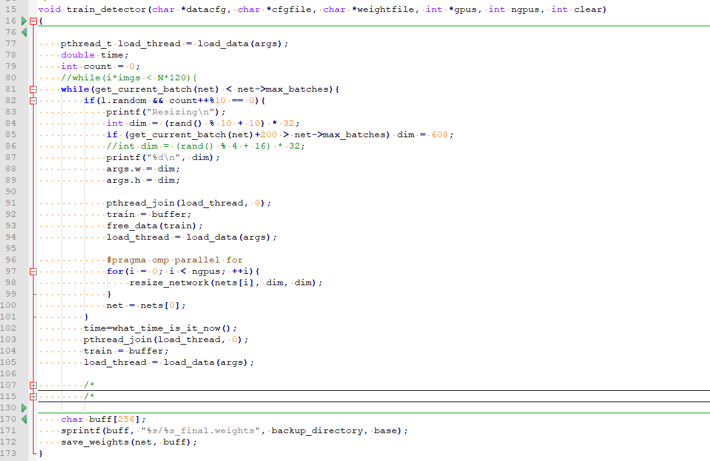

可以看到在examples/detector.c中的`train_detector()`函数共有3次调用`load_data(args)`，第一次调用是为训练阶段做好数据准备工作，充分利用这段时间来加载数据。第二次调用是在resize操作中，可以看到这里只有random和count同时满足条件的情况下会做resize操作，也就是说resize加载的数据是未进行resize过的，因此，需要调整args中的图像宽高之后再重新调用`load_data(args)`加载数据。反之，不做任何处理，之前加载的数据仍然可用。第三次调用就是在数据加载完成后，将加载好的数据保存起来`train=buffer;`，然后开始下一次的加载工作。这一次的数据就会进行这一次的训练操作(调用`train_network`函数)。

## 前向传播Forward

前向传播的主函数在src/network.c中实现，代码如下：

```c++
/* 
** 前向计算网络net每一层的输出
** netp: 构建好的整个网络的指针，这样会比传值快
** 遍历net的每一层网络，从第0层到最后一层，逐层计算每层的输出
*/
void forward_network(network *netp)
{
#ifdef GPU
    if(netp->gpu_index >= 0){
        forward_network_gpu(netp);   
        return;
    }
#endif
    network net = *netp;
    int i;
    // 遍历所有层，从第一层到最后一层，逐层进行前向传播，网络共有net.n层
    for(i = 0; i < net.n; ++i){
        // 当前处理的层为网络的第i层
        net.index = i;
        // 获取当前层
        layer l = net.layers[i];
        // 如果当前层的l.delta已经动态分配了内存，则调用fill_cpu()函数将其所有元素初始化为0
        if(l.delta){
            // 第一个参数为l.delta的元素个数，第二个参数为初始化值，为0
            fill_cpu(l.outputs * l.batch, 0, l.delta, 1);
        }
        // 前向传播: 完成当前层前向推理
        l.forward(l, net);
        // 完成某一层的推理时，置网络的输入为当前层的输出（这将成为下一层网络的输入），要注意的是，此处是直接更改指针变量net.input本身的值，
        // 也就是此处是通过改变指针net.input所指的地址来改变其中所存内容的值，并不是直接改变其所指的内容，
        // 所以在退出forward_network()函数后，其对net.input的改变都将失效，net.input将回到进入forward_network()之前时的值。
        net.input = l.output;
        // 中间变量，用来暂存某层网络的敏感度图（反向传播处理当前层时，用来存储上一层的敏
        //感度图，因为当前层会计算部分上一层的敏感度图，可以参看 network.c 中的 backward_network() 函数） 
        if(l.truth) {
            net.truth = l.output;
        }
    }
    calc_network_cost(netp);
}
```

为了更深入的理解前向传播，我们来理解几个darknet中的经典layer的前向传播实现。

### 前向传播-卷积层

```c++
void forward_convolutional_layer(convolutional_layer l, network net)
{
    int i, j;
    
    // l.outputs=l.out_h*l.out_w*l.out_c在make各网络层函数中赋值(比如make_convolution_layer())
    // 对应每张输入图片的所有特征图的总元素个数(每张输入图片会得到n也即是l.outc张特征图)
    // 初始化输入l.output全为0.0，l.outputs*l.batch为输出的总元素个数，其中l.outputs为batch中一个
    //输入对应的输出的所有元素个数，l.batch为一个batch输入包含的图片张数
    fill_cpu(l.outputs*l.batch, 0, l.output, 1);
    
    // 是否进行二值化操作，这是干吗的?二值网络？
    if(l.xnor){
        binarize_weights(l.weights, l.n, l.c/l.groups*l.size*l.size, l.binary_weights);
        swap_binary(&l);
        binarize_cpu(net.input, l.c*l.h*l.w*l.batch, l.binary_input);
        net.input = l.binary_input;
    }
    
    int m = l.n/l.groups; // 该层的卷积核个数
    int k = l.size*l.size*l.c/l.groups; // 该层每个卷积核的参数元素个数
    int n = l.out_w*l.out_h; // 该层每个特征图的尺寸(元素个数)
    // 该循环即为卷积计算核心代码：所有卷积核对batch中每张图片进行卷积运算
    // 每次循环处理一张输入图片（所有卷积核对batch中一张图片做卷积运算）
    for(i = 0; i < l.batch; ++i){ 
        // 该循环是为了处理分组卷积
        for(j = 0; j < l.groups; ++j){
            // 当前组卷积核(也即权重)，元素个数为l.n*l.c/l.groups*l.size*l.size,
            // 共有l.n行，l.c/l.gropus,l.c*l.size*l.size列
            float *a = l.weights + j*l.nweights/l.groups;
            // 对输入图像进行重排之后的图像数据，所以内存空间申请为网络中最大占用内存
            float *b = net.workspace;
            // 存储一张输入图片（多通道）当前组的输出特征图（输入图片是多通道的，输出
            // 图片也是多通道的，有多少组卷积核就有多少组通道，每个分组后的卷积核得到一张特征图即为一个通道）
            // 这里似乎有点拗口，可以看下分组卷积原理。
            float *c = l.output + (i*l.groups + j)*n*m;
            // 由于有分组卷积，所以获取属于当前组的输入im并按一定存储规则排列的数组b，
            // 以方便、高效地进行矩阵（卷积）计算，详细查看该函数注释（比较复杂）
            // 这里的im实际上只加载了一张图片的数据
            // 关于im2col和sgemm可以看:https://blog.csdn.net/mrhiuser/article/details/52672824
            float *im =  net.input + (i*l.groups + j)*l.c/l.groups*l.h*l.w;
            // 如果这里卷积核尺寸为1，是不需要改变内存排布方式
            if (l.size == 1) {
                b = im;
            } else {
                // 将多通道二维图像im变成按一定存储规则排列的数组b，
                // 以方便、高效地进行矩阵（卷积）计算，详细查看该函数注释（比较复杂）
                // 进行重排，l.c/groups为每张图片的通道数分组，l.h为每张图片的高度，l.w为每张图片的宽度，l.size为卷积核尺寸，l.stride为步长
                // 得到的b为一张图片重排后的结果，也是按行存储的一维数组（共有l.c/l.groups*l.size*l.size行，l.out_w*l.out_h列）
                im2col_cpu(im, l.c/l.groups, l.h, l.w, l.size, l.stride, l.pad, b);
            }
            // 此处在im2col_cpu操作基础上，利用矩阵乘法c=alpha*a*b+beta*c完成对图像卷积的操作
            // 0,0表示不对输入a,b进行转置，
            // m是输入a,c的行数，具体含义为每个卷积核的个数，
            // n是输入b,c的列数，具体含义为每个输出特征图的元素个数(out_h*out_w)，
            // k是输入a的列数也是b的行数，具体含义为卷积核元素个数乘以输入图像的通道数除以分组数（l.size*l.size*l.c/l.groups），
            // a,b,c即为三个参与运算的矩阵（用一维数组存储）,alpha=beta=1为常系数，
            // a为所有卷积核集合,元素个数为l.n*l.c/l.groups*l.size*l.size，按行存储，共有l*n行，l.c/l.groups*l.size*l.size列，
            // 即a中每行代表一个可以作用在3通道上的卷积核，
            // b为一张输入图像经过im2col_cpu重排后的图像数据（共有l.c/l.group*l.size*l.size行，l.out_w*l.out_h列），
            // c为gemm()计算得到的值，包含一张输入图片得到的所有输出特征图（每个卷积核得到一张特征图），c中一行代表一张特征图，
            // 各特征图铺排开成一行后，再将所有特征图并成一大行，存储在c中，因此c可视作有l.n行，l.out_h*l.out_w列。
            // 详细查看该函数注释（比较复杂）
            gemm(0,0,m,n,k,1,a,k,b,n,1,c,n);
        }
    }

    if(l.batch_normalize){
        forward_batchnorm_layer(l, net);
    } else {
        // 加上偏置
        add_bias(l.output, l.biases, l.batch, l.n, l.out_h*l.out_w);
    }

    activate_array(l.output, l.outputs*l.batch, l.activation);
    if(l.binary || l.xnor) swap_binary(&l);
}
```

- im2col_cpu() 函数剖析

```c++
#include "im2col.h"
#include <stdio.h>
/*
** 从输入的多通道数组im（存储图像数据）中获取指定行，列，通道数处的元素值
** im:  函数的输入，所有的数据存成一个一维数组
** height: 每一个通道的高度(即是输入图像的真正高度，补0之前)
** width: 每一个通道的宽度(即是输入图像的真正宽度，补0之前)
** channles： 输入通道数
** row: 要提取的元素所在的行(padding之后的行数)
** col: 要提取的元素所在的列(padding之后的列数)
** channel: 要提取的元素所在的通道
** pad: 图像上下左右补0的个数，四周是一样的
** 返回im中channel通道，row-pad行,col-pad列处的元素值
** 在im中并没有存储补0的元素值，因此height，width都是没有补0时输入图像真正的高、宽；
** 而row与col则是补0之后，元素所在的行列，因此，要准确获取在im中的元素值，首先需要
** 减去pad以获取在im中真实的行列数
*/
float im2col_get_pixel(float *im, int height, int width, int channels,
                        int row, int col, int channel, int pad)
{
    //减去补0长度，获取像素真实的行列数
    row -= pad;
    col -= pad;
    // 如果行列数<0，则返回0(刚好是补0的效果)
    if (row < 0 || col < 0 ||
        row >= height || col >= width) return 0;
    // im存储多通道二维图像的数据格式为: 各个通道所有的所有行并成1行，再多通道依次并成一行
    // 因此width*height*channel首先移位到所在通道的起点位置，再加上width*row移位到所在指定
    // 通道行，再加上col移位到所在列
    return im[col + width*(row + height*channel)];
}

//From Berkeley Vision's Caffe!
//https://github.com/BVLC/caffe/blob/master/LICENSE
/*
** 将输入图片转为便于计算的数组格式
** data_im: 输入图像
** height: 输入图像的高度(行)
** width: 输入图像的宽度(列)
** ksize: 卷积核尺寸
** stride: 卷积核跨度
** pad: 四周补0的长度
** data_col: 相当于输出，为进行格式重排后的输入图像数据  
** 输出data_col的元素个数与data_im个数不相等，一般比data_im个数多，因为stride较小，各个卷积核之间有很多重叠，
** 实际data_col中的元素个数为channels*ksize*ksize*height_col*width_col，其中channels为data_im的通道数，
** ksize为卷积核大小，height_col和width_col如下所注。data_col的还是按行排列，只是行数为channels*ksize*ksize,
** 列数为height_col*width_col，即一张特征图总的元素个数，每整列包含与某个位置处的卷积核计算的所有通道上的像素，
** （比如输入图像通道数为3,卷积核尺寸为3*3，则共有27行，每列有27个元素），不同列对应卷积核在图像上的不同位置做卷积
*/
void im2col_cpu(float* data_im,
     int channels,  int height,  int width,
     int ksize,  int stride, int pad, float* data_col) 
{
    int c,h,w;
    // 计算该层神经网络的输出图像尺寸（其实没有必要再次计算的，因为在构建卷积层时，make_convolutional_layer()函数
    // 已经调用convolutional_out_width()，convolutional_out_height()函数求取了这两个参数，
    // 此处直接使用l.out_h,l.out_w即可，函数参数只要传入该层网络指针就可了，没必要弄这么多参数）
    int height_col = (height + 2*pad - ksize) / stride + 1;
    int width_col = (width + 2*pad - ksize) / stride + 1;
    // 卷积核大小：ksize*ksize是一个卷积核的大小，之所以乘以通道数channels，是因为输入图像有多通道，每个卷积核在做卷积时，
    // 是同时对同一位置多通道的图像进行卷积运算，这里为了实现这一目的，将三个通道将三通道上的卷积核并在一起以便进行计算，因此卷积核
    // 实际上并不是二维的，而是三维的，比如对于3通道图像，卷积核尺寸为3*3，该卷积核将同时作用于三通道图像上，这样并起来就得
    // 到含有27个元素的卷积核，且这27个元素都是独立的需要训练的参数。所以在计算训练参数个数时，一定要注意每一个卷积核的实际
    // 训练参数需要乘以输入通道数。
    int channels_col = channels * ksize * ksize;
    // 外循环次数为一个卷积核的尺寸数，循环次数即为最终得到的data_col的总行数
    for (c = 0; c < channels_col; ++c) {
        // 列偏移，卷积核是一个二维矩阵，并按行存储在一维数组中，利用求余运算获取对应在卷积核中的列数，比如对于
        // 3*3的卷积核（3通道），当c=0时，显然在第一列，当c=5时，显然在第2列，当c=9时，在第二通道上的卷积核的第一列，
        // 当c=26时，在第三列（第三通道上）
        int w_offset = c % ksize;
        // 行偏移，卷积核是一个二维的矩阵，且是按行（卷积核所有行并成一行）存储在一维数组中的，
        // 比如对于3*3的卷积核，处理3通道的图像，那么一个卷积核具有27个元素，每9个元素对应一个通道上的卷积核（互为一样），
        // 每当c为3的倍数，就意味着卷积核换了一行，h_offset取值为0,1,2，对应3*3卷积核中的第1, 2, 3行
        int h_offset = (c / ksize) % ksize;
        // 通道偏移，channels_col是多通道的卷积核并在一起的，比如对于3通道，3*3卷积核，每过9个元素就要换一通道数，
        // 当c=0~8时，c_im=0;c=9~17时，c_im=1;c=18~26时，c_im=2
        int c_im = c / ksize / ksize;
        // 中循环次数等于该层输出图像行数height_col，说明data_col中的每一行存储了一张特征图，这张特征图又是按行存储在data_col中的某行中
        for (h = 0; h < height_col; ++h) {
            // 内循环等于该层输出图像列数width_col，说明最终得到的data_col总有channels_col行，height_col*width_col列
            for (w = 0; w < width_col; ++w) {
                // 由上面可知，对于3*3的卷积核，h_offset取值为0,1,2,当h_offset=0时，会提取出所有与卷积核第一行元素进行运算的像素，
                // 依次类推；加上h*stride是对卷积核进行行移位操作，比如卷积核从图像(0,0)位置开始做卷积，那么最先开始涉及(0,0)~(3,3)
                // 之间的像素值，若stride=2，那么卷积核进行一次行移位时，下一行的卷积操作是从元素(2,0)（2为图像行号，0为列号）开始
                int im_row = h_offset + h * stride;
                // 对于3*3的卷积核，w_offset取值也为0,1,2，当w_offset取1时，会提取出所有与卷积核中第2列元素进行运算的像素，
                // 实际在做卷积操作时，卷积核对图像逐行扫描做卷积，加上w*stride就是为了做列移位，
                // 比如前一次卷积其实像素元素为(0,0)，若stride=2,那么下次卷积元素起始像素位置为(0,2)（0为行号，2为列号）
                int im_col = w_offset + w * stride;
                // col_index为重排后图像中的像素索引，等于c * height_col * width_col + h * width_col +w（还是按行存储，所有通道再并成一行），
                // 对应第c通道，h行，w列的元素
                int col_index = (c * height_col + h) * width_col + w;
                // im2col_get_pixel函数获取输入图像data_im中第c_im通道，im_row,im_col的像素值并赋值给重排后的图像，
                // height和width为输入图像data_im的真实高、宽，pad为四周补0的长度（注意im_row,im_col是补0之后的行列号，
                // 不是真实输入图像中的行列号，因此需要减去pad获取真实的行列号）
                data_col[col_index] = im2col_get_pixel(data_im, height, width, channels,
                        im_row, im_col, c_im, pad);
            }
        }
    }
}
```

### im2col和sgemm详解

这里考虑到结合图片更容易理解im2col的思想，我利用CSDN [Tiger-Gao](https://blog.csdn.net/Mrhiuser)博主的图描述一下。首先，我们把一个单通道的长宽均为4的图片通过im2col重新排布后会变成什么样呢？看下图：

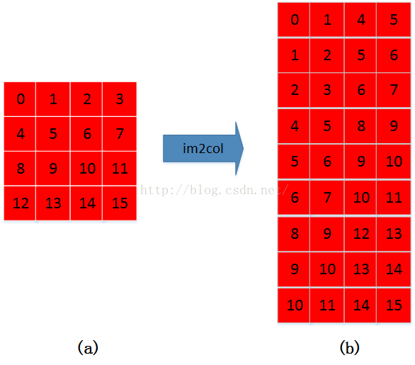

来具体看一下变化过程：

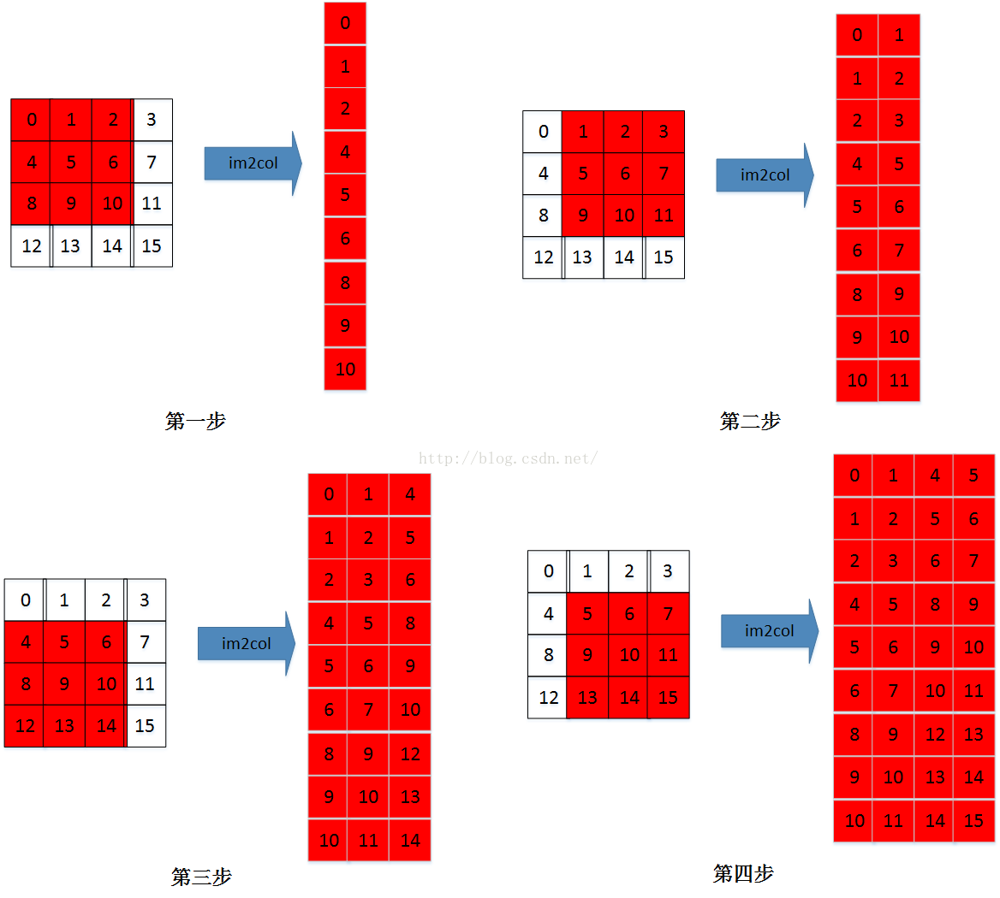

这是单通道的变化过程，那么多通道的呢？首先来看原图：

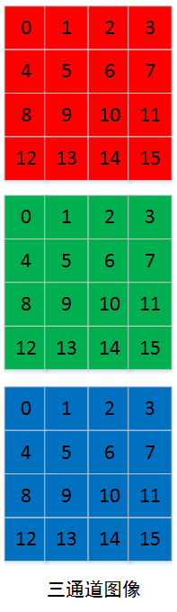


多通道的im2col的过程，是首先im2col第一通道，然后在im2col第二通道，最后im2col第三通道。各通道im2col的数据在内存中也是连续存储的。看下图：

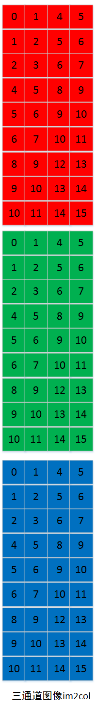

这是原图经过im2col的变化，那么kernel呢？看原图：

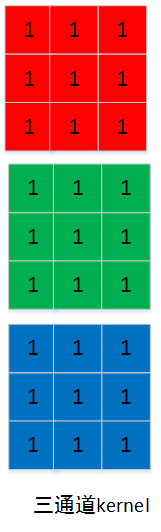

kernel的通道数据在内存中也是连续存储的。所以上面的kernel图像经过im2col算法后可以表示为下图：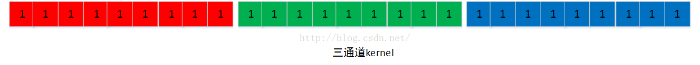

那么我们是如何得到前向传播的结果呢？在DarkNet中和Caffe的实现方式一样，都是Kernel*Img，即是在矩阵乘法中：

```c++
M=1 ，
N=output_h * output_w
K=input_channels * kernel_h * kernel_w
```

结果如下：

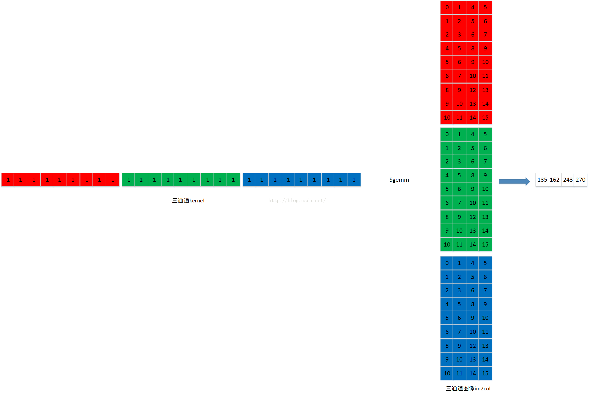

图像数据是连续存储，因此输出图像也可以如下图所示【output_h * output_w】=【2*2】：

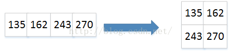

对于多通道图像过程就一样了:

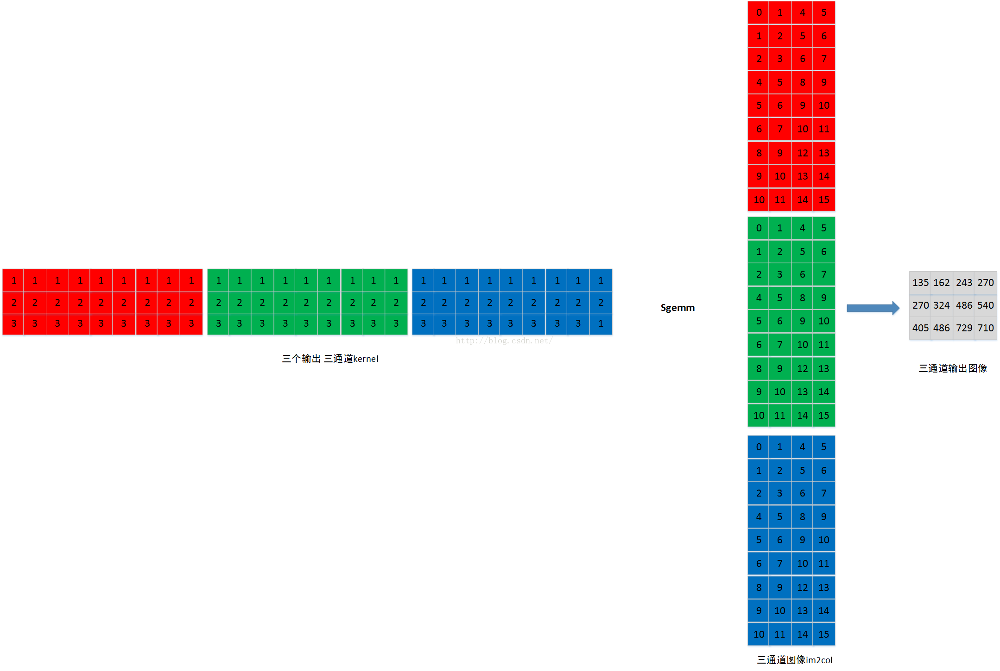

同样，多个输出通道图像的数据是连续存储，因此输出图像也可以如下图所示【output_channels*output_h * output_w】=【3*2*2】,

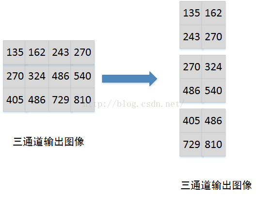

### 前向传播-BN层

```c++
/*
** 计算输入数据x的平均值，输出的mean是一个矢量，比如如果x是多张三通道的图片，那么mean的维度就为通道3
** 由于每次训练输入的都是一个batch的图片，因此最终会输出batch张三通道的图片，mean中的第一个元素就是第
** 一个通道上全部batch张输出特征图所有元素的平均值，本函数的用处之一就是batch normalization的第一步了
** x: 包含所有数据，比如l.output，其包含的元素个数为l.batch*l.outputs
** batch: 一个batch中包含的图片张数，即l.batch
** filters: 该层神经网络的滤波器个数，也即该层网络输出图片的通道数（比如对卷积网络来说，就是核的个数了）
** spatial: 该层神经网络每张输出特征图的尺寸，也即等于l.out_w*l.out_h
** mean: 求得的平均值，维度为filters，也即每个滤波器对应有一个均值（每个滤波器会处理所有图片）
** x的内存排布？此处还是结合batchnorm_layer.c中的forward_batch_norm_layer()函数的调用来解释，其中x为l.output，其包含的元素个数为l
** 有l.batch行，每行有l.out_c*l.out_w*l.out_h个元素，每一行又可以分成l.out_c行，l.out_w*l.out_h列，
** 那么l.mean中的每一个元素，是某一个通道上所有batch的输出的平均值
** （比如卷积层，有3个核，那么输出通道有3个，每张输入图片都会输出3张特征图，可以理解每张输出图片是3通道的，
** 若每次输入batch=64张图片，那么将会输出64张3通道的图片，而mean中的每个元素就是某个通道上所有64张图片
** 所有元素的平均值，比如第1个通道上，所有64张图片像素平均值）
*/
void mean_cpu(float *x, int batch, int filters, int spatial, float *mean)
{
    // scale即是均值中的分母项
    float scale = 1./(batch * spatial);
    int i,j,k;
    // 外循环次数为filters，也即mean的维度，每次循环将得到一个平均值
    for(i = 0; i < filters; ++i){
        mean[i] = 0;
        // 中间循环次数为batch，也即叠加每张输入图片对应的某一通道上的输出
        for(j = 0; j < batch; ++j){
            // 内层循环即叠加一张输出特征图的所有像素值
            for(k = 0; k < spatial; ++k){
                // 计算偏移
                int index = j*filters*spatial + i*spatial + k;
                mean[i] += x[index];
            }
        }
        mean[i] *= scale;
    }
}

/*
** 计算输入x中每个元素的方差
** 本函数的主要用处应该就是batch normalization的第二步了
** x: 包含所有数据，比如l.output，其包含的元素个数为l.batch*l.outputs
** batch: 一个batch中包含的图片张数，即l.batch
** filters: 该层神经网络的滤波器个数，也即是该网络层输出图片的通道数
** spatial: 该层神经网络每张特征图的尺寸，也即等于l.out_w*l.out_h
** mean: 求得的平均值，维度为filters，也即每个滤波器对应有一个均值（每个滤波器会处理所有图片）
*/
void variance_cpu(float *x, float *mean, int batch, int filters, int spatial, float *variance)
{
    // 这里计算方差分母要减去1的原因是无偏估计，可以看：https://www.zhihu.com/question/20983193
    // 事实上，在统计学中，往往采用的方差计算公式都会让分母减1,这时因为所有数据的方差是基于均值这个固定点来计算的，
    // 对于有n个数据的样本，在均值固定的情况下，其采样自由度为n-1（只要n-1个数据固定，第n个可以由均值推出）
    float scale = 1./(batch * spatial - 1);
    int i,j,k;
    for(i = 0; i < filters; ++i){
        variance[i] = 0;
        for(j = 0; j < batch; ++j){
            for(k = 0; k < spatial; ++k){
                int index = j*filters*spatial + i*spatial + k;
                // 每个元素减去均值求平方
                variance[i] += pow((x[index] - mean[i]), 2);
            }
        }
        variance[i] *= scale;
    }
}
void normalize_cpu(float *x, float *mean, float *variance, int batch, int filters, int spatial)
{
    int b, f, i;
    for(b = 0; b < batch; ++b){
        for(f = 0; f < filters; ++f){
            for(i = 0; i < spatial; ++i){
                int index = b*filters*spatial + f*spatial + i;
                x[index] = (x[index] - mean[f])/(sqrt(variance[f]) + .000001f);
            }
        }
    }
}
/*
** axpy 是线性代数中的一种基本操作(仿射变换)完成y= alpha*x + y操作，其中x,y为矢量，alpha为实数系数，
** 请看: https://www.jianshu.com/p/e3f386771c51
** N: X中包含的有效元素个数
** ALPHA: 系数alpha
** X: 参与运算的矢量X
** INCX: 步长(倍数步长)，即x中凡是INCX倍数编号的参与运算
** Y: 参与运算的矢量，也相当于是输出
*/
void axpy_cpu(int N, float ALPHA, float *X, int INCX, float *Y, int INCY)
{
    int i;
    for(i = 0; i < N; ++i) Y[i*INCY] += ALPHA*X[i*INCX];
}

void scal_cpu(int N, float ALPHA, float *X, int INCX)
{
    int i;
    for(i = 0; i < N; ++i) X[i*INCX] *= ALPHA;
}
```

这4个函数对应了前向传播时，BN的计算4个计算公式：

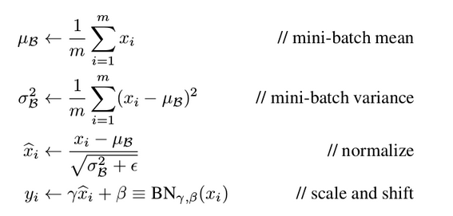

BN的前向传播代码如下:

```c++
// BN层的前向传播函数
void forward_batchnorm_layer(layer l, network net)
{
    if(l.type == BATCHNORM) copy_cpu(l.outputs*l.batch, net.input, 1, l.output, 1);
    copy_cpu(l.outputs*l.batch, l.output, 1, l.x, 1);
    // 训练阶段
    if(net.train){
        // blas.c中有详细注释，计算输入数据的均值，保存为l.mean
        mean_cpu(l.output, l.batch, l.out_c, l.out_h*l.out_w, l.mean);
        // blas.c中有详细注释，计算输入数据的方差，保存为l.variance
        variance_cpu(l.output, l.mean, l.batch, l.out_c, l.out_h*l.out_w, l.variance);
        
        // 计算滑动平均和方差，影子变量，可以参考https://blog.csdn.net/just_sort/article/details/100039418
        scal_cpu(l.out_c, .99, l.rolling_mean, 1);
        axpy_cpu(l.out_c, .01, l.mean, 1, l.rolling_mean, 1);
        scal_cpu(l.out_c, .99, l.rolling_variance, 1);
        axpy_cpu(l.out_c, .01, l.variance, 1, l.rolling_variance, 1);
        // 减去均值，除以方差得到x^，论文中的第3个公式
        normalize_cpu(l.output, l.mean, l.variance, l.batch, l.out_c, l.out_h*l.out_w);  
        // BN层的输出
        copy_cpu(l.outputs*l.batch, l.output, 1, l.x_norm, 1);
    } else {
        // 测试阶段，直接用滑动变量来计算输出
        normalize_cpu(l.output, l.rolling_mean, l.rolling_variance, l.batch, l.out_c, l.out_h*l.out_w);
    }
    // 最后一个公式，对输出进行移位和偏置
    scale_bias(l.output, l.scales, l.batch, l.out_c, l.out_h*l.out_w);
    add_bias(l.output, l.biases, l.batch, l.out_c, l.out_h*l.out_w);
}
```

这里就不多解释了，原理请看：https://blog.csdn.net/yuechuen/article/details/71502503

### 前向传播-Pooling层

```c++
/*
** 最大池化层的前向传播函数
** l: 当前层(最大池化层)
** net: 整个网络结构
** 最大池化层处理图像的方式与卷积层类似，也是将最大池化核在图像
** 平面上按照指定的跨度移动，并取对应池化核区域中最大元素值为对应输出元素。
** 最大池化层没有训练参数（没有权重以及偏置），因此，相对与卷积来说，
** 其前向（以及下面的反向）过程比较简单，实现上也是非常直接，不需要什么技巧。
*/
void forward_maxpool_layer(const maxpool_layer l, network net)
{
    int b,i,j,k,m,n;
    // 初始偏移设定为四周补0长度的负值
    int w_offset = -l.pad/2;
    int h_offset = -l.pad/2;
    // 获取当前层的输出尺寸
    int h = l.out_h;
    int w = l.out_w;
    // 获取当前层输入图像的通道数，为什么是输入通道数？不应该为输出通道数吗？
    // 实际二者没有区别，对于最大池化层来说，输入有多少通道，输出就有多少通道！
    int c = l.c;
    // 遍历batch中每一张输入图片，计算得到与每一张输入图片具有相同通道的输出图
    for(b = 0; b < l.batch; ++b){
        // 对于每张输入图片，将得到通道数一样的输出图，以输出图为基准，按输出图通道，行，列依次遍历
        // （这对应图像在l.output的存储方式，每张图片按行铺排成一大行，然后图片与图片之间再并成一行）。
        // 以输出图为基准进行遍历，最终循环的总次数刚好覆盖池化核在输入图片不同位置进行池化操作。
        for(k = 0; k < c; ++k){
            for(i = 0; i < h; ++i){
                for(j = 0; j < w; ++j){
                    // out_index为输出图中的索引：out_index = b * c * w * h + k * w * h + h * w + w，展开写可能更为清晰些
                    int out_index = j + w*(i + h*(k + c*b));
                    float max = -FLT_MAX;
                    int max_i = -1;
                    // 下面两个循环回到了输入图片，计算得到的cur_h以及cur_w都是在当前层所有输入元素的索引，内外循环的目的是
                    // 找寻输入图像中，以(h_offset + i*l.stride, w_offset + j*l.stride)为左上起点，尺寸为l.size池化区域中的
                    //最大元素值max及其在所有输入元素中的索引max_i
                    for(n = 0; n < l.size; ++n){
                        for(m = 0; m < l.size; ++m){
                            //cur_h, cur_w是在所有输入图像的第k通道的cur_h行与cur_w列，index是在所有输入图像元素中的总索引
                            int cur_h = h_offset + i*l.stride + n;
                            int cur_w = w_offset + j*l.stride + m;
                            int index = cur_w + l.w*(cur_h + l.h*(k + b*l.c));
                            // 边界检查：正常情况下，是不会越界的，但是如果有补0操作，就会越界了，这里的处理方式是直接让这些元素值为-FLT_MAX
                            int valid = (cur_h >= 0 && cur_h < l.h &&
                                         cur_w >= 0 && cur_w < l.w);
                            float val = (valid != 0) ? net.input[index] : -FLT_MAX;
                            // 记录这个池化区域中最大的元素及其在所有输入元素中的总索引
                            max_i = (val > max) ? index : max_i;
                            max   = (val > max) ? val   : max;
                        }
                    }
                    // 由此得到最大池化层每一个输出元素值及其在所有输入元素中的总索引。
                    // 为什么需要记录每个输出元素值对应在输入元素中的总索引呢？因为在下面的反向过程中需要用到，在计算当前最大池化层上一层网络的敏感度时，
                    // 需要该索引明确当前层的每个元素究竟是取上一层输出（也即上前层输入）的哪一个元素的值，具体见下面backward_maxpool_layer()函数的注释。
                    l.output[out_index] = max;
                    l.indexes[out_index] = max_i;
                }
            }
        }
    }
}
```

### 前向传播-Dropout层

```c++
/*
** dropout层的前向传播函数
** l: 当前dropout层网络
** net: 整个网络
** dropout层同样没有训练参数，因此前向传播比较简单，只完成一个事：按指定概率l.probability，
** 丢弃输入元素，并将保留下来的输入元素乘以比例因子（采用的是inverted dropout，这种方式实现更为方便，
** 且代码接口比较统一，想想看，如果采用标准的droput，则测试阶段还需要进入forward_dropout_layer()，
** 使每个输入乘以保留概率，而使用inverted dropout，测试阶段根本就不需要进入到forward_dropout_layer）。
*/
void forward_dropout_layer(dropout_layer l, network net)
{
    int i;
    // 如果网络当前不是出于训练阶段而是出于测试阶段，则直接返回(使用inverted dropout带来的方便)
    if (!net.train) return;
    // 遍历dropout层的每一个输入元素(包含整个batch)，按照指定的概率l.probability置为0或者按l.scale缩放
    for(i = 0; i < l.batch * l.inputs; ++i){
        // 产生一个0~1之间的均匀分布的随机数
        float r = rand_uniform(0, 1);
        // 每个输入元素都对应一个随机数，保存在l.rand中
        l.rand[i] = r;
        // 如果r小于l.probability（l.probability是舍弃概率），则舍弃该输入元素，注意，舍弃并不是删除
        // 而是将其值置为0,所以输入元素个数总数没变（因故输出元素个数l.outputs等于l.inputs）
        if(r < l.probability) net.input[i] = 0;
        // 否则保留该输入元素，并乘以比例因子
        else net.input[i] *= l.scale;
    }
}
```

## 反向传播

反向传播的主函数在src/network.c中实现，代码如下:

```c++
/*
** 反向计算网络net每一层的梯度图，并进而计算每一层的权重、偏置更新值，最后完成每一层权重与偏置更新
** 流程: 遍历net的每一层网络，从最后一层到第一层(此处所指的第一层不是指输入层，而是与输入层直接相连的第一层隐含层)进行反向传播
*/
void backward_network(network *netp)
{
#ifdef GPU
    if(netp->gpu_index >= 0){
        backward_network_gpu(netp);   
        return;
    }
#endif
    network net = *netp;
    int i;
    // 在进行反向传播之前先保存一下原来的net，下面会用到orig的input
    network orig = net;
    for(i = net.n-1; i >= 0; --i){
        layer l = net.layers[i];
        if(l.stopbackward) break;
        // i = 0时，也即已经到了网络的第1层（或者说第0层，看个人习惯了～）了，
        // 就是直接与输入层相连的第一层隐含层（注意不是输入层，我理解的输入层就是指输入的图像数据，
        // 严格来说，输入层不算一层网络，因为输入层没有训练参数，也没有激活函数），这个时候，不需要else中的赋值，1）对于第1层来说，其前面已经没有网络层了（输入层不算），
        // 因此没有必要再计算前一层的参数，故没有必要在获取上一层；2）第一层的输入就是图像输入，也即整个net最原始的输入，在开始进行反向传播之前，已经用orig变量保存了
        // 最为原始的net，所以net.input就是第一层的输入，不需要通过net.input=prev.output获取上一层的输出作为当前层的输入；3）同1），第一层之前已经没有层了，
        // 也就不需要计算上一层的delta，即不需要再将net.delta链接到prev.delta，此时进入到l.backward()中后，net.delta就是NULL（可以参看darknet.h中关于delta
        // 的注释），也就不会再计算上一层的敏感度了（比如卷积神经网络中的backward_convolutional_layer()函数）
        // 这几行代码就是给net.input和net.delta赋值
        if(i == 0){
            net = orig;
        }else{
            // 获取上一层
            layer prev = net.layers[i-1];
            // 上一层的输出作为当前层的输入（下面l.backward()会用到，具体是在计算当前层权重更新值时要用到）
            net.input = prev.output;
            // 上一层的敏感度图（l.backward()会同时计算上一层的敏感度图）
            net.delta = prev.delta;
        }
        // 标志参数，当前网络的活跃层 
        net.index = i;
        // 反向计算第i层的敏感度图、权重及偏置更新值，并更新权重、偏置（同时会计算上一层的敏感度图，
        // 存储在net.delta中，但是还差一个环节：乘上上一层输出对加权输入的导数，也即上一层激活函数对加权输入的导数）
        l.backward(l, net);
    }
}
```

为了更深入的理解反向传播，我们来理解几个darknet中的经典layer的反向传播实现。

### 反向传播-卷积层

```c++
/*
** 卷积神经网络反向传播核心函数
** 算法流程
** 1. 调用gradient_array()计算当前层l所有输出元素关于加权输入的导数值（也即激活函数关于输入的导数值），
**    并乘上上一次调用backward_convolutional_layer()还没计算完的l.delta，得到当前层最终的敏感度图
** 2. 如果网络进行了BN，则:
** 3. 如果网络没有进行BN，则直接调用 backward_bias()计算当前层所有卷积核的偏置更新值
** 4. 依次调用im2col_cpu()，gemm()函数计算当前层权重系数更新值
** 5. 如果上一层的delta已经动态分配了内存，则依次调用gemm_tn(), col2im_cpu()计算上一
**    层的敏感度图（并未完成所有计算，还差一个步骤）；
**    每次调用本函数会计算完成当前层的敏感度计算，同时计算当前层的偏置、权重更新值，除此之外，
**    还会计算上一层的敏感度图，但是要注意的是， 并没有完全计算完，还差一步：乘上激活函数对加
**    权输入的导数值。这一步在下一次调用本函数时完成。
*/
void backward_convolutional_layer(convolutional_layer l, network net)
{
    int i, j;
    int m = l.n/l.groups; // 卷积核个数/组数
    // 每一个卷积核元素个数(包括l.c/l.groups（l.c为该层网络接受的输入图片的通道数）
    // 个通道上的卷积核元素个数总数，比如卷积核尺寸为3*3), 输入图片有3个通道，分组数为1，
    // 因为要同时作用于输入的3个通道上，所以实际上这个卷积核是一个立体的，共有3*3*3=27
    // 个元素，这些元素都是要训练的参数
    int n = l.size*l.size*l.c/l.groups;
    //每张输出特征图的元素个数：out_w，out_h是输出特征图的宽高
    int k = l.out_w*l.out_h; 
    // dz / dx = dz / df * df / dx 链式法则
// 需要明确的一点是：求导是从网络最后一层往前推
    // 计算当前层激活函数对加权输入的导数值并乘以l.delta相应元素，从而彻底完成当前层敏感度图的计算，得到当前层的敏感度图l.delta。
    // l.output存储了该层网络的所有输出:该层网络接收一个batch的输入图片，其中每张图片经过卷积处理后得到的特征图尺寸为:l.out_w*l.out_h
    // 该层卷积网络共有l.n个卷积核，因此一张输入图片共输出l.n张宽高为l.out_w,l.out_h的特征图（l.output为一张图所有输出特征图的总元素个数），
    // 所以所有输入图片也即l.output中的总元素个数为：l.n*l.out_w*l.out_h*l.batch；
    // l.activation为该卷积层的激活函数类型，l.delta就是gradient_array()函数计算得到的l.output中每一个元素关于激活函数函数输入的导数值，
    // 注意，这里直接利用输出值求得激活函数关于输入的导数值是因为神经网络中所使用的绝大部分激活函数关于输入的导数值都可以描述为输出值的函数表达式，
    // 比如对于Sigmoid激活函数（记作f(x)），其导数值为f(x)'=f(x)*(1-f(x)),因此如果给出y=f(x)，那么f(x)'=y*(1-y)，只需要输出值y就可以了，不需要输入x的值，
    //（暂时不确定darknet中有没有使用特殊的激活函数，以致于必须要输入值才能够求出导数值，在activiation.c文件中，有几个激活函数暂时没看懂，也没在网上查到）。
    // l.delta是一个一维数组，长度为l.batch * l.outputs（其中l.outputs = l.out_h * l.out_w * l.out_c），在make_convolutional_layer()动态分配内存；
    // 再强调一次：gradient_array()不单单是完成激活函数对输入的求导运算，还完成计算当前层敏感度图的最后一步：
    // l.delta中每个元素乘以激活函数对输入的导数（注意gradient_arry中使用的是*=运算符）。
    //  每次调用backward_convolutional_laye时，都会完成当前层敏感度图的计算，同时会计算上一层的敏感度图，但对于上一层，
    // 其敏感度图并没有完全计算完成，还差一步，需要等到下一次调用backward_convolutional_layer()时来完成，诚如col2im_cpu()中注释一样。
    gradient_array(l.output, l.outputs*l.batch, l.activation, l.delta);

    if(l.batch_normalize){
        backward_batchnorm_layer(l, net);
    } else {
        // 计算偏置的更新值：每个卷积核都有一个偏置，偏置的更新值也即误差函数对偏置的导数，
        // 这个导数的计算很简单，实际所有的导数已经求完了，都存储在l.delta中，
        // 接下来只需把l.delta中对应同一个卷积核的项加起来就可以（卷积核在图像上逐行逐列跨步移动做卷积，
        // 每个位置处都有一个输出，共有l.out_w*l.out_h个，这些输出都与同一个偏置关联，因此将l.delta中
        // 对应同一个卷积核的项加起来即得误差函数对这个偏置的导数）
        backward_bias(l.bias_updates, l.delta, l.batch, l.n, k);
    }

    // 遍历batch中的每张照片，对于l.delta来说，
    // 每张图片是分开存的，因此其维度会达到：l.batch*l.n*l.out_w*l.out_h，
    for(i = 0; i < l.batch; ++i){
        // 枚举分组数
        for(j = 0; j < l.groups; ++j){
            // net.workspace的元素个数为所有层中最大的l.workspace_size（在make_convolutional_layer()计算得
            // 到workspace_size的大小，在parse_network_cfg()中动态分配内存，此值对应未使用gpu时的情况）,
            // net.workspace充当一个临时工作空间的作用，存储临时所需要的计算参数，比如每层单张图片重排后的
            // 结果（这些参数马上就会参与卷积运算），一旦用完，就会被马上更新（因此该变量的值的更新频率比较大）
            float *a = l.delta + (i*l.groups + j)*m*k;
            float *b = net.workspace;
            float *c = l.weight_updates + j*l.nweights/l.groups;
            // 进入本函数之前，在backward_network()函数中，已经将net.input赋值为prev.output，也即若当前层为
            // 第l层，net.input此时已经是第l-1层的输出
            float *im  = net.input + (i*l.groups + j)*l.c/l.groups*l.h*l.w;
            // 这里和老版本的实现不一样，这里申请了一个临时变量来进行计算
            float *imd = net.delta + (i*l.groups + j)*l.c/l.groups*l.h*l.w;
            // 和前向传播一样，如果核的尺寸为1，就不用调整内存排布了
            // 下面两步：im2col_cpu()与gemm()是为了计算当前层的权重更新值（其实也就是误差函数对当前层权重的导数）
            // 将多通道二维图像net.input变成按一定存储规则排列的数组b，以方便、高效地进行矩阵（卷积）计算，详细查看该函数注释（比较复杂），
            // im2col_cput每次仅处理net.input（包含整个batch）中的一张输入图片（对于第一层，则就是读入的图片，
            // 对于之后的层，这些图片都是上一层的输出，通道数等于上一层卷积核个数）。
            // 最终重排的b为l.c / l.groups * l.size * l.size行，l.out_h * l.out_w列。请看: https://blog.csdn.net/mrhiuser/article/details/52672824
            // 你会发现在前向forward_convolutional_layer()函数中，也为每层的输入进行了重排，但是很遗憾的是，并没有一个l.workspace把每一层的重排结果
            // 保存下来，而是统一存储到net.workspace中，并被不断擦除更新，那为什么不保存呢？保存下来不是省掉一大笔额外重复计算开销？原因有两个：
            // 1）net.workspace中只存储了一张输入图片的重排结果，所以重排下张图片时，马上就会被擦除,当然你可能会想，那为什么不弄一个l.worspaces将
            // 每层所有输入图片的结果保存呢？这引出第二个原因;2）计算成本是降低了，但存储空间需求急剧增加，想想每一层都有l.batch张图，且每张都是多通道的，
            // 排后其元素个数还会增多，如果一个batch有128张图，输入图片尺寸为400*400，3通道，网络有16层（假设每层输入输出尺寸及通道数都一样），那么单单
            // 为了存储这些重排结果，就需要128*400*400*3*16*4/1024/1024/1024 = 3.66G，所以为了权衡，只能重复计算！
            // 实际上读过NCNN和我的博客中Sobel 的SSE优化的文章的话，知道这种方式就是原位推理，正是为了减少内存消耗

            if(l.size == 1){
                b = im;
            } else {
                im2col_cpu(im, l.c/l.groups, l.h, l.w, 
                        l.size, l.stride, l.pad, b);
            }
            // 下面计算当前层的权重更新值，所谓权重更新值就是weight = weight - alpha * weight_update中的weight_update，
            // 权重更新值等于当前层敏感度图中每个元素乘以相应的像素值，因为一个权重跟当前层多个输出有关联（权值共享，
            // 即卷积核在图像中跨步移动做卷积，每个位置卷积得到的值都与该权值相关),所以对每一个权重更新值来说，需要
            //在l.delta中找出所有与之相关的敏感度，乘以相应像素值，再求和，具体实现的方式依靠im2col_cpu()与gemm()完成。
            // 此处在im2col_cpu操作基础上，利用矩阵乘法c=alpha*a*b+beta*c完成对图像卷积的操作；
            // 0表示不对输入a进行转置，1表示对输入b进行转置；
            // m是输入a,c的行数，具体含义为卷积核的个数(l.n/l.groups)；
            // n是输入b,c的列数，具体含义为每个卷积核元素个数乘以输入图像的通道数处于分组数(l.size*l.size*l.c/l.groups)；
            // k是输入a的列数也是b的行数，具体含义为每个输出特征图的元素个数（l.out_w*l.out_h）；
            // a,b,c即为三个参与运算的矩阵（用一维数组存储）,alpha=beta=1为常系数；
            // a为l.delta的一大行。l.delta为本层所有输出元素（包含整个batch中每张图片的所有输出特征图）关于加权输入的导数（即激活函数的导数值）集合,
            // 元素个数为l.batch * l.out_h * l.out_w * l.out_c / l.groups（l.out_c = l.n），按行存储，共有l.batch行，l.out_c / l.groups * l.out_h * l.out_w列，
            // 即l.delta中每行包含一张图的所有输出图，故这么一大行，又可以视作有l.out_c/l.groups（l.out_c=l.n）小行，l.out_h*l*out_w小列，而一次循环就是处理l.delta的一大行，
            // 故可以将a视作l.out_c/l.gropus行，l.out_h*l*out_w列的矩阵；
            // b为单张输入图像经过im2col_cpu重排后的图像数据；
            // c为输出，按行存储，可视作有l.n/l.groups行，l.c/l.groups*l.size*l.size列（l.c是输入图像的通道数，l.n是卷积核个数），
            // 即c就是所谓的误差项（输出关于加权输入的导数），或者敏感度（一个核有l.c*l.size*l.size个权重，共有l.n个核）。
            // 由上可知：
            // a: (l.out_c / l.groups) * (l.out_h*l*out_w)
            // b: (l.c / l.groups * l.size * l.size) * (l.out_h * l.out_w)
            // c: (l.n / l.groups) * (l.c / l.groups*l.size*l.size)（注意：l.n / l.groups = l.out_c）
            // 故要进行a * b + c计算，必须对b进行转置（否则行列不匹配），因故调用gemm_nt()函数
            gemm(0,1,m,n,k,1,a,k,b,k,1,c,n);
            // 接下来，用当前层的敏感度图l.delta以及权重l.weights（还未更新）来获取上一层网络的敏感度图，BP算法的主要流程就是依靠这种层与层之间敏感度反向递推传播关系来实现。
            // 在network.c的backward_network()中，会从最后一层网络往前遍循环历至第一层，而每次开始遍历某一层网络之前，都会更新net.input为这一层网络前一层的输出，即prev.output,
            // 同时更新net.delta为prev.delta，因此，这里的net.delta是当前层前一层的敏感度图。
            // 已经强调很多次了，再说一次：下面得到的上一层的敏感度并不完整，完整的敏感度图是损失函数对上一层的加权输入的导数，
            // 而这里得到的敏感度图是损失函数对上一层输出值的导数，还差乘以一个输出值也即激活函数对加权输入的导数。
            if (net.delta) {
                // 当前层还未更新的权重
                a = l.weights + j*l.nweights/l.groups;
                // 每次循环仅处理一张输入图，注意移位（l.delta的维度为l.batch * l.out_c / l.groups * l.out_w * l.out_h）
                //（注意l.n / l.groups = l.out_c，另外提一下，对整个网络来说，每一层的l.batch其实都是一样的）
                b = l.delta + (i*l.groups + j)*m*k;
                
                // net.workspace和上面一样，还是一张输入图片的重排，不同的是，此处我们只需要这个容器，而里面存储的值我们并不需要，在后面的处理过程中，
                // 会将其中存储的值一一覆盖掉（尺寸维持不变，还是(l.c / l.group * l.size * l.size) * (l.out_h * l.out_w）
                c = net.workspace;
                if (l.size == 1) {
                    c = imd;
                }
                // 相比上一个gemm，此处的a对应上一个的c,b对应上一个的a，c对应上一个的b，即此处a,b,c的行列分别为：
                // a: (l.n / l.gropus) * (l.c / l.gropus*l.size*l.size)，表示当前层所有权重系数
                // b: (l.out_c) * (l.out_h*l*out_w)（注意：l.n / l.gropus = l.out_c），表示当前层的敏感度图
                // c: (l.c * l.size * l.size) * (l.out_h * l.out_w)，表示上一层的敏感度图（其元素个数等于上一层网络单张输入图片的所有输出元素个数），
                // 此时要完成a * b + c计算，必须对a进行转置（否则行列不匹配），因故调用gemm_tn()函数。
                // 此操作含义是用：用当前层还未更新的权重值对敏感度图做卷积，得到包含上一层所有敏感度信息的矩阵，但这不是上一层最终的敏感度图，
                // 因为此时的c，也即net.workspace的尺寸为(l.c * l.size * l.size) * (l.out_h * l.out_w)，明显不是上一层的输出尺寸l.c*l.w*l.h，
                // 接下来还需要调用col2im_cpu()函数将其恢复至l.c*l.w*l.h（可视为l.c行，l.w*l.h列），这才是上一层的敏感度图（实际还差一个环节，
                // 这个环节需要等到下一次调用backward_convolutional_layer()才完成：将net.delta中每个元素乘以激活函数对加权输入的导数值）。
                // 完成gemm这一步，如col2im_cpu()中注释，是考虑了多个卷积核导致的一对多关系（上一层的一个输出元素会流入到下一层多个输出元素中），
                // 接下来调用col2im_cpu()则是考虑卷积核重叠（步长较小）导致的一对多关系。
                gemm(1,0,n,k,m,1,a,n,b,k,0,c,k);
                
                // 对c也即net.workspace进行重排，得到的结果存储在net.delta中，每次循环只会处理一张输入图片，因此，此处只会得到一张输入图产生的敏感图（注意net.delta的移位）,
                // 整个循环结束后，net.delta的总尺寸为l.batch * l.h * l.w * l.c，这就是上一层网络整个batch的敏感度图，可视为有l.batch行，l.h*l.w*l.c列，
                // 每行存储了一张输入图片所有输出特征图的敏感度
                // col2im_cpu()函数中会调用col2im_add_pixel()函数，该函数中使用了+=运算符，也即该函数要求输入的net.delta的初始值为0,而在gradient_array()中注释到l.delta的元素是不为0（也不能为0）的，
                // 看上去是矛盾的，实则不然，gradient_array()使用的l.delta是当前层的敏感度图，而在col2im_cpu()使用的net.delta是上一层的敏感度图，正如gradient_array()中所注释的，
                // 当前层l.delta之所以不为0,是因为从后面层反向传播过来的，对于上一层，显然还没有反向传播到那，因此net.delta的初始值都是为0的（注意，每一层在构建时，就为其delta动态分配了内存，
                // 且在前向传播时，为每一层的delta都赋值为0,可以参考network.c中forward_network()函数）
                if (l.size != 1) {
                    col2im_cpu(net.workspace, l.c/l.groups, l.h, l.w, l.size, l.stride, l.pad, imd);
                }
            }
        }
    }
}
```

### 反向传播-BN层

```c++
// 这里是对论文中最后一个公式的缩放系数求梯度更新值
// x_norm 代表BN层前向传播的输出值
// delta 代表上一层的梯度图
// batch 为l.batch，即一个batch的图片数
// n代表输出通道数，也即是输入通道数
// size 代表w * h
// scale_updates 代表scale的梯度更新值
// y = gamma * x + beta
// dy / d(gamma) = x
void backward_scale_cpu(float *x_norm, float *delta, int batch, int n, int size, float *scale_updates)
{
    int i,b,f;
    for(f = 0; f < n; ++f){
        float sum = 0;
        for(b = 0; b < batch; ++b){
            for(i = 0; i < size; ++i){
                int index = i + size*(f + n*b);
                sum += delta[index] * x_norm[index];
            }
        }
        scale_updates[f] += sum;
    }
}

// 对均值求导
// 对应了论文中的求导公式3，不过Darknet特殊的点在于是先计算均值的梯度
// 这个时候方差是没有梯度的，所以公式3的后半部分为0，也就只保留了公式3的前半部分
// 不过我从理论上无法解释这种操作会带来什么影响，但从目标检测来看应该是没有影响的
void mean_delta_cpu(float *delta, float *variance, int batch, int filters, int spatial, float *mean_delta)
{

    int i,j,k;
    for(i = 0; i < filters; ++i){
        mean_delta[i] = 0;
        for (j = 0; j < batch; ++j) {
            for (k = 0; k < spatial; ++k) {
                int index = j*filters*spatial + i*spatial + k;
                mean_delta[i] += delta[index];
            }
        }
        mean_delta[i] *= (-1./sqrt(variance[i] + .00001f));
    }
}
// 对方差求导
// 对应了论文中的求导公式2
void  variance_delta_cpu(float *x, float *delta, float *mean, float *variance, int batch, int filters, int spatial, float *variance_delta)
{
    int i,j,k;
    for(i = 0; i < filters; ++i){
        variance_delta[i] = 0;
        for(j = 0; j < batch; ++j){
            for(k = 0; k < spatial; ++k){
                int index = j*filters*spatial + i*spatial + k;
                variance_delta[i] += delta[index]*(x[index] - mean[i]);
            } 
        }
        variance_delta[i] *= -.5 * pow(variance[i] + .00001f, (float)(-3./2.));
    }
}
// 求出BN层的梯度敏感度图
// 对应了论文中的求导公式4，即是对x_i求导
void normalize_delta_cpu(float *x, float *mean, float *variance, float *mean_delta, float *variance_delta, int batch, int filters, int spatial, float *delta)
{
    int f, j, k;
    for(j = 0; j < batch; ++j){
        for(f = 0; f < filters; ++f){
            for(k = 0; k < spatial; ++k){
                int index = j*filters*spatial + f*spatial + k;
                delta[index] = delta[index] * 1./(sqrt(variance[f] + .00001f)) + variance_delta[f] * 2. * (x[index] - mean[f]) / (spatial * batch) + mean_delta[f]/(spatial*batch);
            }
        }
    }
}
// BN层的反向传播函数
void backward_batchnorm_layer(layer l, network net)
{
    // 如果在测试阶段，均值和方差都可以直接用滑动变量来赋值
    if(!net.train){
        l.mean = l.rolling_mean;
        l.variance = l.rolling_variance;
    }
    // 在卷积层中定义了backward_bias，并有详细注释
    backward_bias(l.bias_updates, l.delta, l.batch, l.out_c, l.out_w*l.out_h);
    // 这里是对论文中最后一个公式的缩放系数求梯度更新值
    backward_scale_cpu(l.x_norm, l.delta, l.batch, l.out_c, l.out_w*l.out_h, l.scale_updates);
    // 也是在convlution_layer.c中定义的函数，先将敏感度图乘以l.scales
    scale_bias(l.delta, l.scales, l.batch, l.out_c, l.out_h*l.out_w);
    
    // 对应了https://blog.csdn.net/just_sort/article/details/100039418 中对均值求导数
    mean_delta_cpu(l.delta, l.variance, l.batch, l.out_c, l.out_w*l.out_h, l.mean_delta);
    // 对应了https://blog.csdn.net/just_sort/article/details/100039418 中对方差求导数
    variance_delta_cpu(l.x, l.delta, l.mean, l.variance, l.batch, l.out_c, l.out_w*l.out_h, l.variance_delta);
    // 计算敏感度图，对应了论文中的最后一部分
    normalize_delta_cpu(l.x, l.mean, l.variance, l.mean_delta, l.variance_delta, l.batch, l.out_c, l.out_w*l.out_h, l.delta);
    if(l.type == BATCHNORM) copy_cpu(l.outputs*l.batch, l.delta, 1, net.delta, 1);
}
```

原理还是请看：https://blog.csdn.net/yuechuen/article/details/71502503 ，就不多描述了

### 反向传播-Pooling层

```c++
/*
** 最大池化层反向传播函数
** l: 当前最大池化层
** net: 整个网络
** 说明：这个函数看上去很简单，比起backward_convolutional_layer()少了很多，这都是有原因的。实际上，在darknet中，不管是什么层，
**      其反向传播函数都会先后做两件事：1）计算当前层的敏感度图l.delta、权重更新值以及偏置更新值；2）计算上一层的敏感度图net.delta（部分计算，
**      要完成计算得等到真正到了这一层再说）。而这里，显然没有第一步，只有第二步，而且很简单，这是为什么呢？首先回答为什么没有第一步。注意当前层l是最大池化层，
**      最大池化层没有训练参数，说的再直白一点就是没有激活函数，或者认为激活函数就是f(x)=x，所以激活函数对于加权输入的导数其实就是1,
**      正如在backward_convolutional_layer()注释的那样，每一层的反向传播函数的第一步是将之前（就是下一层计算得到的，注意过程是反向的）
**      未计算完得到的l.delta乘以激活函数对加权输入的导数，以最终得到当前层的敏感度图，而对于最大池化层来说，每一个输出对于加权输入的导数值都是1,
**      同时并没有权重及偏置这些需要训练的参数，自然不再需要第一步；对于第二步为什么会如此简单。
*/
void backward_maxpool_layer(const maxpool_layer l, network net)
{
    int i;
    // 获取当前最大池化层l的输出尺寸h,w
    int h = l.out_h;
    int w = l.out_w;
    // 获取当前层输入/输出通道数
    int c = l.c;
    // 计算上一层的敏感度图（未计算完全，还差一个环节，这个环节等真正反向到了那层再执行，但是其实已经完全计算了，因为池化层无参数）
    // 循环总次数为当前层输出总元素个数（包含所有输入图片的输出，即维度为l.out_h * l.out_w * l.c * l.batch，注意此处l.c==l.out_c）
    // 对于上一层输出中的很多元素的导数值为0,而对最大值元素，其导数值为1；再乘以当前层的敏感度图，导数值为0的还是为0,导数值为1则就等于当前层的敏感度值。
    // 以输出图总元素个数进行遍历，刚好可以找出上一层输出中所有真正起作用（在某个池化区域中充当了最大元素值）也即敏感度值不为0的元素，而那些没有起作用的元素，
    // 可以不用理会，保持其初始值0就可以了。
    for(i = 0; i < h*w*c*l.batch; ++i){
        int index = l.indexes[i];
        // 遍历的基准是以当前层的输出元素为基准的，l.indexes记录了当前层每一个输出元素与上一层哪一个输出元素有真正联系（也即上一层对应池化核区域中最大值元素的索引），
        // 所以index是上一层中所有输出元素的索引，且该元素在当前层某个池化域中充当了最大值元素，这个元素的敏感度值将直接传承当前层对应元素的敏感度值。 
        // 而net.delta中，剩下没有被index按索引访问到的元素，就是那些没有真正起到作用的元素，这些元素的敏感度值为0（net.delta已经在前向时将所有元素值初始化为0）
        // 至于为什么要用+=运算符，原因有两个，和卷积类似：一是池化核由于跨度较小，导致有重叠区域；二是batch中有多张图片，需要将所有图片的影响加起来。
        net.delta[index] += l.delta[i];
    }
}
```

### 反向传播-Dropout层

```c++
/*
** dropout层反向传播函数
** l: 当前dropout层网络
** net: 整个网络
** dropout层的反向传播相对简单，因为其本身没有训练参数，也没有激活函数，或者说激活函数就为f(x) = x，也
** 也就是激活函数关于加权输入的导数值为1,因此其自身的敏感度值已经由其下一层网络反向传播时计算完了，
** 没有必要再乘以激活函数关于加权输入的导数了。剩下要做的就是计算上一层的敏感度图net.delta，这个计算也很简单，详见下面注释。
*/
void backward_dropout_layer(dropout_layer l, network net)
{
    int i;
    // 如果进入backward_dropout_layer()函数，那没得说，一定是训练阶段，因为测试阶段压根就没有反向过程，只有前向过程，
    // 所以就不再需要像forward_dropout_layer()函数中一样判断net.train是不是处于训练阶段了
    // 如果net.delta为空，则返回（net.delta为空则说明已经反向到第一层了，此处所指第一层，是net.layers[0]，
    // 也是与输入层直接相连的第一层隐含层，详细参见：network.c中的forward_network()函数）
    if(!net.delta) return;
    // 因为dropout层的输入输出元素个数相等，所以dropout层的敏感度图的维度就为l.batch*l.inputs（每一层的敏感度值与该层的输出维度一致），
    // 以下循环遍历当前层的敏感度图，并根据l.rand的指示反向计算上一层的敏感度值，由于当前dropout层与上一层之间的连接没有权重，
    // 或者说连接权重为0（对于舍弃的输入）或固定的l.scale（保留的输入，这个比例因子是固定的，不需要训练），所以计算过程比较简单，
    // 只需让保留输入对应输出的敏感度值乘以l.scale，其他输入（输入是针对当前dropout层而言，实际为上一层的输出）的敏感度值直接置为0即可
    for(i = 0; i < l.batch * l.inputs; ++i){
        float r = l.rand[i];
        // 与前向过程forward_dropout_layer照应，根据l.rand指示，如果r小于l.probability，说明是舍弃的输入，其敏感度值为0；
        // 反之是保留下来的输入元素，其敏感度值为当前层对应输出的敏感度值乘以l.scale
        if(r < l.probability) net.delta[i] = 0;
        else net.delta[i] *= l.scale;
    }
}
```


# 参考资料

https://blog.csdn.net/gzj2013/article/details/84837198

https://blog.csdn.net/u014540717/column/info/13752

https://github.com/hgpvision/darknet

https://blog.csdn.net/mrhiuser/article/details/52672824

https://blog.csdn.net/yuechuen/article/details/71502503