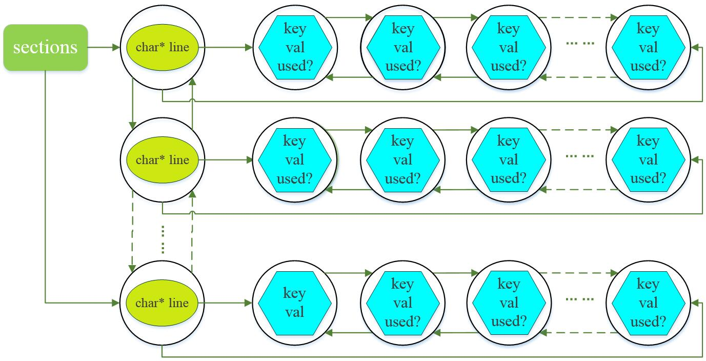

# 1.网络参数解析函数：parse_network_cfg

```C++
network *parse_network_cfg(char *filename)
{
    // 从神经网络结构参数文件中读入所有神经网络层的结构参数，存储到sections中，
    // sections的每个node包含一层神经网络的所有结构参数
    list *sections = read_cfg(filename);
    // 获取sections的第一个节点，可以查看一下cfg/***.cfg文件，其实第一块参数（以[net]开头）不是某层神经网络的参数，
    // 而是关于整个网络的一些通用参数，比如学习率，衰减率，输入图像宽高，batch大小等，
    // 具体的关于某个网络层的参数是从第二块开始的，如[convolutional],[maxpool]...，
    // 这些层并没有编号，只说明了层的属性，但层的参数都是按顺序在文件中排好的，读入时，
    // sections链表上的顺序就是文件中的排列顺序。
    node *n = sections->front;
    if(!n) error("Config file has no sections");
    // 创建网络结构并动态分配内存：输入网络层数为sections->size - 1，sections的第一段不是网络层，而是通用网络参数
    network *net = make_network(sections->size - 1);
    //设置网络所用gpu的编号(gpu_index在cuda.c中用extern声明)
    net->gpu_index = gpu_index;
    //size_params结构体元素不含指针变量
    size_params params;

    section *s = (section *)n->val;
    list *options = s->options;
    if(!is_network(s)) error("First section must be [net] or [network]");
    parse_net_options(options, net);

    params.h = net->h;
    params.w = net->w;
    params.c = net->c;
    params.inputs = net->inputs;
    params.batch = net->batch;
    params.time_steps = net->time_steps;
    params.net = net;

    size_t workspace_size = 0;
    n = n->next;
    int count = 0;
    free_section(s);
    //输出结果提示
    fprintf(stderr, "layer     filters    size              input                output\n");
    while(n){
        params.index = count;
        fprintf(stderr, "%5d ", count);
        s = (section *)n->val;
        options = s->options;
        layer l = {0};
        LAYER_TYPE lt = string_to_layer_type(s->type);
        if(lt == CONVOLUTIONAL){
            l = parse_convolutional(options, params);
        }else if(lt == DECONVOLUTIONAL){
            l = parse_deconvolutional(options, params);
        }else if(lt == LOCAL){
            l = parse_local(options, params);
        }else if(lt == ACTIVE){
            l = parse_activation(options, params);
        }else if(lt == LOGXENT){
            l = parse_logistic(options, params);
        }else if(lt == L2NORM){
            l = parse_l2norm(options, params);
        }else if(lt == RNN){
            l = parse_rnn(options, params);
        }else if(lt == GRU){
            l = parse_gru(options, params);
        }else if (lt == LSTM) {
            l = parse_lstm(options, params);
        }else if(lt == CRNN){
            l = parse_crnn(options, params);
        }else if(lt == CONNECTED){
            l = parse_connected(options, params);
        }else if(lt == CROP){
            l = parse_crop(options, params);
        }else if(lt == COST){
            l = parse_cost(options, params);
        }else if(lt == REGION){
            l = parse_region(options, params);
        }else if(lt == YOLO){
            l = parse_yolo(options, params);
        }else if(lt == ISEG){
            l = parse_iseg(options, params);
        }else if(lt == DETECTION){
            l = parse_detection(options, params);
        }else if(lt == SOFTMAX){
            l = parse_softmax(options, params);
            net->hierarchy = l.softmax_tree;
        }else if(lt == NORMALIZATION){
            l = parse_normalization(options, params);
        }else if(lt == BATCHNORM){
            l = parse_batchnorm(options, params);
        }else if(lt == MAXPOOL){
            l = parse_maxpool(options, params);
        }else if(lt == REORG){
            l = parse_reorg(options, params);
        }else if(lt == AVGPOOL){
            l = parse_avgpool(options, params);
        }else if(lt == ROUTE){
            l = parse_route(options, params, net);
        }else if(lt == UPSAMPLE){
            l = parse_upsample(options, params, net);
        }else if(lt == SHORTCUT){
            l = parse_shortcut(options, params, net);
        }else if(lt == DROPOUT){
            l = parse_dropout(options, params);
            l.output = net->layers[count-1].output;
            l.delta = net->layers[count-1].delta;
#ifdef GPU
            l.output_gpu = net->layers[count-1].output_gpu;
            l.delta_gpu = net->layers[count-1].delta_gpu;
#endif
        }else{
            fprintf(stderr, "Type not recognized: %s\n", s->type);
        }
        l.clip = net->clip;
        l.truth = option_find_int_quiet(options, "truth", 0);
        l.onlyforward = option_find_int_quiet(options, "onlyforward", 0);
        l.stopbackward = option_find_int_quiet(options, "stopbackward", 0);
        l.dontsave = option_find_int_quiet(options, "dontsave", 0);
        l.dontload = option_find_int_quiet(options, "dontload", 0);
        l.numload = option_find_int_quiet(options, "numload", 0);
        l.dontloadscales = option_find_int_quiet(options, "dontloadscales", 0);
        l.learning_rate_scale = option_find_float_quiet(options, "learning_rate", 1);
        l.smooth = option_find_float_quiet(options, "smooth", 0);
        option_unused(options);
        net->layers[count] = l;
        if (l.workspace_size > workspace_size) workspace_size = l.workspace_size;
        free_section(s);
        n = n->next;
        ++count;
        // 构建每一层之后，如果之后还有层，则更新params.h,params.w,params.c及params.inputs为上一层相应的输出参数
        if(n){
            params.h = l.out_h;
            params.w = l.out_w;
            params.c = l.out_c;
            params.inputs = l.outputs;
        }
    }
    free_list(sections);
    layer out = get_network_output_layer(net);
    net->outputs = out.outputs;
    net->truths = out.outputs;
    if(net->layers[net->n-1].truths) net->truths = net->layers[net->n-1].truths;
    net->output = out.output;
    net->input = calloc(net->inputs*net->batch, sizeof(float));
    net->truth = calloc(net->truths*net->batch, sizeof(float));
#ifdef GPU
    net->output_gpu = out.output_gpu;
    net->input_gpu = cuda_make_array(net->input, net->inputs*net->batch);
    net->truth_gpu = cuda_make_array(net->truth, net->truths*net->batch);
#endif
    if(workspace_size){
        //printf("%ld\n", workspace_size);
#ifdef GPU
        if(gpu_index >= 0){
            net->workspace = cuda_make_array(0, (workspace_size-1)/sizeof(float)+1);
        }else {
            net->workspace = calloc(1, workspace_size);
        }
#else
        net->workspace = calloc(1, workspace_size);
#endif
    }
    return net;
}
```

我们先看一下list,section,node,kvp这几个结构体的定义：

```
typedef struct{
    int size;
    node *front;
    node *back;
} list;

typedef struct{
    char *type;
    list *options;
} section;

typedef struct node{
    void *val;
    struct node *next;
    struct node *prev;
} node;

typedef struct{
    char *key;
    char *val;
    int used;
} kvp;
```


然后我们再观察一下yolo.cfg得：

```c++
[net]
# Testing
batch=1
subdivisions=1
# Training
# batch=64
# subdivisions=8
height=448
width=448
channels=3
momentum=0.9
decay=0.0005
saturation=1.5
exposure=1.5
hue=.1

learning_rate=0.0005
policy=steps
steps=200,400,600,20000,30000
scales=2.5,2,2,.1,.1
max_batches = 40000

[convolutional]
batch_normalize=1
filters=64
size=7
stride=2
pad=1
activation=leaky
```


用矩形表示list，椭圆表示section，圆形表示node，六边形表示kvp，为了表达方便，我就把section和kvp放到了node里面，其实这样表达有失妥当，大家理解就行。根据作者代码我们就可以得出以下的参数网络：

我们来大概解释下该参数网，首先创建一个list，取名sections，记录一共有多少个section（一个section存储了CNN一层所需参数）；然后创建一个node，该node的void类型的指针指向一个新创建的section；该section的char类型指针指向.cfg文件中的某一行（line），然后将该section的list指针指向一个新创建的node，该node的void指针指向一个kvp结构体，kvp结构体中的key就是.cfg文件中的关键字（如：batch，subdivisions等），val就是对应的值；如此循环就形成了上述的参数网络图。这里copy自https://blog.csdn.net/u014540717/article/details/53193433 ，可以结合代码进行理解这个参数网。

# 2.加载权重函数：load_weights(&net, weightfile)

```c++
//卷积层权重加载
void load_convolutional_weights(layer l, FILE *fp)
{
    if(l.binary){
        //load_convolutional_weights_binary(l, fp);
        //return;
    }
    if(l.numload) l.n = l.numload;
    //卷积层的参数个数，卷积核个数×通道数×卷积核长度×卷积核宽度/分组数(对于组卷积)
    int num = l.c/l.groups*l.n*l.size*l.size;
    fread(l.biases, sizeof(float), l.n, fp);
    //如果使用了BN层，那就加载3个参数
    if (l.batch_normalize && (!l.dontloadscales)){
        fread(l.scales, sizeof(float), l.n, fp);
        fread(l.rolling_mean, sizeof(float), l.n, fp);
        fread(l.rolling_variance, sizeof(float), l.n, fp);
        if(0){
            int i;
            for(i = 0; i < l.n; ++i){
                printf("%g, ", l.rolling_mean[i]);
            }
            printf("\n");
            for(i = 0; i < l.n; ++i){
                printf("%g, ", l.rolling_variance[i]);
            }
            printf("\n");
        }
        if(0){
            fill_cpu(l.n, 0, l.rolling_mean, 1);
            fill_cpu(l.n, 0, l.rolling_variance, 1);
        }
        if(0){
            int i;
            for(i = 0; i < l.n; ++i){
                printf("%g, ", l.rolling_mean[i]);
            }
            printf("\n");
            for(i = 0; i < l.n; ++i){
                printf("%g, ", l.rolling_variance[i]);
            }
            printf("\n");
        }
    }
    //weights是一个float的数组，存储权重
    fread(l.weights, sizeof(float), num, fp);
    //if(l.c == 3) scal_cpu(num, 1./256, l.weights, 1);
    //是否需要把matrix的维度进行转换，类似于permute
    if (l.flipped) {
        transpose_matrix(l.weights, l.c*l.size*l.size, l.n);
    }
    //if (l.binary) binarize_weights(l.weights, l.n, l.c*l.size*l.size, l.weights);
#ifdef GPU
    if(gpu_index >= 0){
        push_convolutional_layer(l);
    }
#endif
}

//加载权重函数
void load_weights_upto(network *net, char *filename, int start, int cutoff)
{
#ifdef GPU
    if(net->gpu_index >= 0){
        cuda_set_device(net->gpu_index);
    }
#endif
    fprintf(stderr, "Loading weights from %s...", filename);
    //fflush()函数冲洗流中的信息，该函数通常用于处理磁盘文件。
    fflush(stdout);
    FILE *fp = fopen(filename, "rb");
    if(!fp) file_error(filename);

    int major;
    int minor;
    int revision;
    /*
    size_t fread ( void *buffer, size_t size, size_t count, FILE *stream)
    fread是一个函数。从一个文件流中读数据，最多读取count个项，每个项size个字节，如果调用成功返回实
    际读取到的项个数（小于或等于count），如果不成功或读到文件末尾返回0。
    */
    fread(&major, sizeof(int), 1, fp);
    fread(&minor, sizeof(int), 1, fp);
    fread(&revision, sizeof(int), 1, fp);
    if ((major*10 + minor) >= 2 && major < 1000 && minor < 1000){
        fread(net->seen, sizeof(size_t), 1, fp);
    } else {
        int iseen = 0;
        fread(&iseen, sizeof(int), 1, fp);
        *net->seen = iseen;
    }
    int transpose = (major > 1000) || (minor > 1000);

    int i;
    //cutoff 代表,cutoff之后的网络层参数不家宅，finetune的时候用
    for(i = start; i < net->n && i < cutoff; ++i){
        //读取各层权重
        layer l = net->layers[i];
        if (l.dontload) continue;
        if(l.type == CONVOLUTIONAL || l.type == DECONVOLUTIONAL){
            load_convolutional_weights(l, fp);
        }
        if(l.type == CONNECTED){
            load_connected_weights(l, fp, transpose);
        }
        if(l.type == BATCHNORM){
            load_batchnorm_weights(l, fp);
        }
        if(l.type == CRNN){
            load_convolutional_weights(*(l.input_layer), fp);
            load_convolutional_weights(*(l.self_layer), fp);
            load_convolutional_weights(*(l.output_layer), fp);
        }
        if(l.type == RNN){
            load_connected_weights(*(l.input_layer), fp, transpose);
            load_connected_weights(*(l.self_layer), fp, transpose);
            load_connected_weights(*(l.output_layer), fp, transpose);
        }
        if (l.type == LSTM) {
            load_connected_weights(*(l.wi), fp, transpose);
            load_connected_weights(*(l.wf), fp, transpose);
            load_connected_weights(*(l.wo), fp, transpose);
            load_connected_weights(*(l.wg), fp, transpose);
            load_connected_weights(*(l.ui), fp, transpose);
            load_connected_weights(*(l.uf), fp, transpose);
            load_connected_weights(*(l.uo), fp, transpose);
            load_connected_weights(*(l.ug), fp, transpose);
        }
        if (l.type == GRU) {
            if(1){
                load_connected_weights(*(l.wz), fp, transpose);
                load_connected_weights(*(l.wr), fp, transpose);
                load_connected_weights(*(l.wh), fp, transpose);
                load_connected_weights(*(l.uz), fp, transpose);
                load_connected_weights(*(l.ur), fp, transpose);
                load_connected_weights(*(l.uh), fp, transpose);
            }else{
                load_connected_weights(*(l.reset_layer), fp, transpose);
                load_connected_weights(*(l.update_layer), fp, transpose);
                load_connected_weights(*(l.state_layer), fp, transpose);
            }
        }
        if(l.type == LOCAL){
            int locations = l.out_w*l.out_h;
            int size = l.size*l.size*l.c*l.n*locations;
            fread(l.biases, sizeof(float), l.outputs, fp);
            fread(l.weights, sizeof(float), size, fp);
#ifdef GPU
            if(gpu_index >= 0){
                push_local_layer(l);
            }
#endif
        }
    }
    fprintf(stderr, "Done!\n");
    fclose(fp);
}

void load_weights(network *net, char *filename)
{
    //调用load_weights_upto(net, filename, net->n)函数
    load_weights_upto(net, filename, 0, net->n);
}
```


# 3. 训练网络

