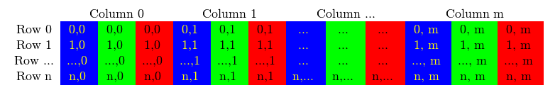

# 训练样本加载

这篇笔记主要分析data.c文件，load_data()函数的调用流程如下:

```c++
load_data(args) -> load_threads() -> load_data_in_thread() -> 
load_thread() -> load_data_detection()
```

前面的四个函数都是在对线程的调用进行封装, 主要是分配每个线程的加载任务量. 最底层的数据加载任务由 `load_data_detection()` 函数完成.  所有的数据(图片数据和标注信息数据)加载完成之后再拼接到一个大的数组中。在 darknet 中, 图片的存储形式是一个行向量, 向量长度为[batch, h, w, 3]. 同时图片数据被归一化到 0-1 之间。

## 1. 线程分配和数据拼接

load_threads函数扮演了加载指挥官的角色，根据线程个数平均分配加载任务，最后在所有子线程加载完数据后整合数据。具体请参考src/data.c中的load_threads函数。

## 2. 底层的数据加载

### 2.1 加载图像数据

#### 2.1.1 读取图片后转换数据格式为image

根据图片路径加载图像数据, darknet 内部使用结构体 image 保存图像数据. 而使用 OpenCV 读取得到的图像数据格式为 IPL, 因此需要将图片格式转换为 darknet 的 image 结构体类型。其中Darknet中image结构体得定义如下：

```c++
//图片
typedef struct {
    int w;
    int h;
    int c;
    float *data;
} image;
```

图片数据格式转换的具体实现可参考函数:  `ipl_to_image()`

```c++
image ipl_to_image(IplImage* src)
{
    int h = src->height;
    int w = src->width;
    int c = src->nChannels;
    image im = make_image(w, h, c);
    unsigned char *data = (unsigned char *)src->imageData;
    int step = src->widthStep;
    int i, j, k;

    for(i = 0; i < h; ++i){
        for(k= 0; k < c; ++k){
            for(j = 0; j < w; ++j){
                im.data[k*w*h + i*w + j] = data[i*step + j*c + k]/255.;
            }
        }
    }
    return im;
}
```


前面说过, darknet 中 image 结构体中的图片数据保存在一个一维数组中, 那图片数据的行列通道是怎么安排的?

先看看 OpenCV 中的图片数据存储格式. 使用 cvLoadImage() 函数将图片数据读取到内存中后, 其存储形式如下图所示:



而 image 结构体中的数据保存格式为:


接下来如果需要调整通道顺序, 例如从 BGR 到 RGB, 只需要交换首尾两个位置对应的像素即可。

#### 2.1.2 数据resize细节

place_image() 函数究竟做了什么? 对图像执行 resize 操作. resize 的策略是二次线性插值方法, 但是该函数之前的其他操作也是值得研究的.

(1) 新建一个 resize 的图像, 尺寸为 w*h, 并将所有像素初始化为 0.5;
(2) 对原始图像的宽高(orig.w, orig.h)使用 jitter 进行抖动, 得到新的长宽比;
(3) 利用新的长宽比和缩放因子为(0.25, 2)得到缩放后的长和宽(nw, nh);
(4) 新的长宽(nw, nh)减去原来的长宽(w, h)的偏移可用来作平移增广;

这些工作之后调用 place_image() 函数, 其功能是使用插值后的图像填充 resized 的图像。

```c++
/*
** 先用双线性插值对输入图像im进行重排得到一个虚拟中间图（之所以称为虚拟，是因为这个中间图并不是一个真实存在的变量），
** 而后将中间图嵌入到canvas中（中间图尺寸比canvas小）或者将canvas当作一个mask在im上抠图（canvas尺寸小于中间图尺寸）（canvas是帆布/画布的意思）
** 输入： im    源图
**       w     中间图的宽度
**       h     中间图的高度
**       dx    中间图插入到canvas的x方向上的偏移
**       dy    中间图插入到canvas的y方向上的偏移
**       canvas 目标图（在传入到本函数之前，所有像素值已经初始化为某个值，比如0.5）
** 说明： 此函数是实现图像数据增强手段中的一种：平移（不含旋转等其他变换）。先用双线性插值将源图im重排至一个中间图，im与中间图的长宽比不一定一样，
**      而后将中间图放入到输出图canvas中（这两者的长宽比也不一定一样），分两种情况，如果中间图的尺寸小于输出图canvas，
**      显然，中间图是填不满canvas的，那么就将中间图随机的嵌入到canvas的某个位置（dx,dy就是起始位置，此时二者大于0,相对canvas的起始位置，这两个数是在函数外随机生成的），
**      因为canvas已经在函数外初始化了（比如所有像素值初始化为0.5），剩下没填满的就保持为初始化值；
**      如果canvas的尺寸小于中间图尺寸，那么就将canvas当作一个mask，在中间图上随机位置（dx,dy就是起始位置，此时二者小于0,相对中间图的起始位置）抠图。
**      因为canvas与中间图的长宽比不一样，因此，有可能在一个方向是嵌入情况，而在另一个方向上是mask情况，总之理解就可以了。
**      可以参考一下：
**      https://medium.com/@vivek.yadav/dealing-with-unbalanced-data-generating-additional-data-by-jittering-the-original-image-7497fe2119c3
**      上面网址给出了100张对原始图像进行增强之后的图片，可以看到很多图片有填满的，也有未填满的（无黑区），且位置随机。
**      (当然，网址中给出的图片包含了多种用于图片数据增强的变换，此函数仅仅完成最简单的一种：平移)
**
*/
void place_image(image im, int w, int h, int dx, int dy, image canvas)
{
    int x, y, c;
    for(c = 0; c < im.c; ++c){
         // 中循环和内循环的循环次数分别为中间图的行数与列数，这两个循环下来，实际可以得到中间图的所有像素值（当然，此处并没有形成一个真实的中间图变量）
        for(y = 0; y < h; ++y){
            for(x = 0; x < w; ++x){
                // x为中间图的列坐标，x/w*im.w得到中间图对应在源图上的列坐标（按比例得到，亚像素坐标）
                float rx = ((float)x / w) * im.w;
                // y为中间图的行坐标，y/h*im.h得到中间图对应在源图上的行坐标（TODO:这里代码实现显然存在不足，应该放入中循环，以减小没必要的计算）
                float ry = ((float)y / h) * im.h;
                // 利用源图进行双线性插值得到中间图在c通道y行x列处的像素值
                float val = bilinear_interpolate(im, rx, ry, c);
                // 设置canvas中c通道y+dy行x+dx列的像素值为val
                // dx,dy可大于0也可以小于0,大于0的情况很好理解，对于小于0的情况，x+dx以及y+dy会有一段小于0的，这时
                // set_pixel()函数无作为，直到x+dx,y+dy大于0时，才有作为，这样canvas相当于起到一个mask的作用
                set_pixel(canvas, x + dx, y + dy, c, val);
            }
        }
    }
}
```

#### 2.1.3 数据增强

上面提到, `resize` 操作中隐式地使用了平移增广操作. 而显式使用的增广操作由 HSV 亮度增广`random_distort_image()` 和随机翻转增广 `flip_image()`。这部分操作很简单, 切换到 HSV 空间后进行增广, 操作完成后在转换到 RGB 空间即可。 代码也一目了然。


### 2.2 加载标注的Ground Truth信息

`fill_truth_detection`函数主要由3个部分构成：

- 读取标注框文件

- 随机打乱标注框顺序

- 根据增广参数矫正框的坐标

```c++
/*
** 用来获取一张图的真实标签信息，对于图像检测，标签信息包括物体的类别（用类别id表示）以及定位信息，定位用矩形框来表示，包含矩形中心点坐标x,y以及宽高w,h，
** 本函数读入一张图片中所有标签信息（一张图片可能存在多个物体，每个物体都含有一条类别信息以及一个矩形框信息）
** 输入： path     一张图片所在路径，字符数组
**       num_boxes 每张图片允许处理的最大的矩形框数（如果图片中包含的矩形框大于num_boxes，那么不管，随机取其中num_boxes个参与训练）
**       truth    存储一张图片包含的所有真实信息（标签信息），相当于返回值，对于检测而言，主要包括物体类别以及定位（矩形框）信息，
**                truth是一个一维数组，每张矩形框有5条信息，因此truth中每5个数对应一个矩形框数据
**       classes  本函数并未使用该参数
**       flip     图片在之前读入时（比如在load_data_detection函数中）是否进行过了左右翻转
**       dx       此参数需要参考load_data_detection函数中的注释，dx是中间图相对最终图的起点位置的x坐标除以最终图的宽度（并取负值）
**       dy       此参数需要参考load_data_detection函数中的注释，dy是中间图相对最终图的起点位置的x坐标除以最终图的高度（并取负值）
**       sx       此参数需要参考load_data_detection函数中的注释，sx是中间图宽度与最终图宽度的比值
**       sy       此参数需要参考load_data_detection函数中的注释，sy是中间图高度与最终图高度的比值
** 说明： 后面五个参数，用来矫正矩形框的信息，因为在此函数之前，对输入图片进行了缩放、平移、左右翻转一系列的数据增强操作，这些操作不会改变物体的类别信息，
**       但会改变物体的位置信息，也即矩形框信息，需要进行矫正，这些参数的具体含义上面可能未说清，具体可参看本函数内部调用的correct_boxes()函数的用法
*/
void fill_truth_detection(char *path, int num_boxes, float *truth, int classes, int flip, float dx, float dy, float sx, float sy)
{
    // 定义一个数组，分配4096个字符（字节）内存，用以存放本图片标签信息文件所在路径
    char labelpath[4096];
    // // 下面一连串地调用find_replace()函数，是为了得到每张训练图片的标签数据（.txt文件）所在路径
    // 通过调用find_replace()函数，对每张图片的绝对路径进行修改，得到对应的标签数据所在路径。
    // 比如，图片的路径为：/home/happy/Downloads/darknet_dataset/VOCdevkit/VOC2007/JPEGImages/000001.jpg，
    // 通过连续调用find_place()函数，最终可以得到对应的标签数据路径labelpath为：
    // /home/happy/Downloads/darknet_dataset/VOCdevkit/VOC2007/labels/000001.txt
    // 注意，下面共调用了7次find_replace函数，可以分为两部分，第一部分是将图片的文件夹名字替换为labels，
    // 图片的路径可能为JPEGImages,images或raw中的一种，所以调用了三次以应对多种情况，实际只有一次调用真正有效;
    // 第二部分是将修改后缀，图片的格式有可能为jpg,png,JPG,JPEG四种中的一种，不管是哪种，
    // 最终替换成标签数据格式，即.txt格式，因此，此处也是为了应对可能的四种情况，才四次调用了find_replace，实际起作用的只有一次调用。
    //这里的images,JPEGImages，raw是不同的数据集中存储训练图片的文件夹
    find_replace(path, "images", "labels", labelpath);
    find_replace(labelpath, "JPEGImages", "labels", labelpath);

    find_replace(labelpath, "raw", "labels", labelpath);
    find_replace(labelpath, ".jpg", ".txt", labelpath);
    find_replace(labelpath, ".png", ".txt", labelpath);
    find_replace(labelpath, ".JPG", ".txt", labelpath);
    find_replace(labelpath, ".JPEG", ".txt", labelpath);
    int count = 0;
    //// 读入一张图片的所有box标签信息，count为读到的box个数
    box_label *boxes = read_boxes(labelpath, &count);
    // 随机打乱一张照片中所有box的索引编号
    randomize_boxes(boxes, count);
    //从输入的原始图片，到真正给神经网络用的图片，可能经过了平移，随机截取，左右翻转等数据增强操作，这些操作，都会改变矩形框的值，需要进行矫正
    correct_boxes(boxes, count, dx, dy, sx, sy, flip);
    // 如果图片中含有的矩形框数多于num_boxes，则保持count = num_boxes，因为num_boxes是指定的每张图片最多参与训练的矩形框数，如果超过这个数，
    // 就在其中随机选择num_boxes个（box的顺序已经随机打乱了）
    if(count > num_boxes) count = num_boxes;
    float x,y,w,h;
    int id;
    int i;
    int sub = 0;
    // 提取count个矩形框信息
    for (i = 0; i < count; ++i) {
        x =  boxes[i].x;
        y =  boxes[i].y;
        w =  boxes[i].w;
        h =  boxes[i].h;
        // 物体的类别并不是用字符串来表示，而是用物体类别对应的id来表示，如对于VOC数据集，共有20类物体，那么对应的id编号为从0~19号
        id = boxes[i].id;
        // 矩形框大小下限：如果长宽小于0.001（矩形框的长宽不到图片长宽的0.001）认为没有包含物体
        if ((w < .001 || h < .001)) {
            ++sub;
            continue;
        }
        // 最后将矩形框信息赋给truth
        truth[(i-sub)*5+0] = x;
        truth[(i-sub)*5+1] = y;
        truth[(i-sub)*5+2] = w;
        truth[(i-sub)*5+3] = h;
        truth[(i-sub)*5+4] = id;
    }
    // 所有矩形框的信息已经提取，及时释放堆内存
    free(boxes);
}
```


## 3. load_data(args)的使用技巧

首先来看一下`examples/detectot.c`中的train_detector函数：

```c++
/*
** 图像检测网络训练函数（针对图像检测的网络训练）
** 输入： datacfg     训练数据描述信息文件路径及名称
**       cfgfile     神经网络结构配置文件路径及名称
**       weightfile  预训练参数文件路径及名称
**       gpus        GPU卡号集合（比如使用1块GPU，那么里面只含0元素，默认使用0卡号GPU；如果使用4块GPU，那么含有0,1,2,3四个元素；如果不使用GPU，那么为空指针）
**       ngpus       使用GPUS块数，使用一块GPU和不使用GPU时，nqpus都等于1
**       clear       
** 说明：关于预训练参数文件weightfile，
*/
void train_detector(char *datacfg, char *cfgfile, char *weightfile, int *gpus, int ngpus, int clear)
{
    // 读入数据配置文件信息
    list *options = read_data_cfg(datacfg);
    // 从options找出训练图片路径信息，如果没找到，默认使用"data/train.list"路径下的图片信息（train.list含有标准的信息格式：<object-class> <x> <y> <width> <height>），
    // 该文件可以由darknet提供的scripts/voc_label.py根据自行在网上下载的voc数据集生成，所以说是默认路径，其实也需要使用者自行调整，也可以任意命名，不一定要为train.list，
    // 甚至可以不用voc_label.py生成，可以自己不厌其烦的制作一个（当然规模应该是很小的，不然太累了。。。）
    // 读入后，train_images将含有训练图片中所有图片的标签以及定位信息
    char *train_images = option_find_str(options, "train", "data/train.list");
    char *backup_directory = option_find_str(options, "backup", "/backup/");

    srand(time(0));
     // 提取配置文件名称中的主要信息，用于输出打印（并无实质作用），比如提取cfg/yolo.cfg中的yolo，用于下面的输出打印
    char *base = basecfg(cfgfile);
    printf("%s\n", base);
    float avg_loss = -1;
    // 构建网络：用多少块GPU，就会构建多少个相同的网络（不使用GPU时，ngpus=1）
    network **nets = calloc(ngpus, sizeof(network));
   
    srand(time(0));
    // 随机产生种子
    int seed = rand();
    int i;
    // for循环次数为ngpus，使用多少块GPU，就循环多少次（不使用GPU时，ngpus=1，也会循环一次）
    // 这里每一次循环都会构建一个相同的神经网络，如果提供了初始训练参数，也会为每个网络导入相同的初始训练参数
    for(i = 0; i < ngpus; ++i){
        srand(seed);
#ifdef GPU
        cuda_set_device(gpus[i]);
#endif
        nets[i] = load_network(cfgfile, weightfile, clear);
        nets[i]->learning_rate *= ngpus;
    }
    srand(time(0));
    network *net = nets[0];

    int imgs = net->batch * net->subdivisions * ngpus;
    printf("Learning Rate: %g, Momentum: %g, Decay: %g\n", net->learning_rate, net->momentum, net->decay);
    data train, buffer;

    layer l = net->layers[net->n - 1];

    int classes = l.classes;
    float jitter = l.jitter;

    list *plist = get_paths(train_images);
    //int N = plist->size;
    char **paths = (char **)list_to_array(plist);

    load_args args = get_base_args(net);
    args.coords = l.coords;
    args.paths = paths;
    args.n = imgs;
    args.m = plist->size;
    args.classes = classes;
    args.jitter = jitter;
    args.num_boxes = l.max_boxes;
    args.d = &buffer;
    args.type = DETECTION_DATA;
    //args.type = INSTANCE_DATA;
    args.threads = 64;
    // 1.
    pthread_t load_thread = load_data(args);
    double time;
    int count = 0;
    //while(i*imgs < N*120){
    while(get_current_batch(net) < net->max_batches){
        if(l.random && count++%10 == 0){
            printf("Resizing\n");
            int dim = (rand() % 10 + 10) * 32;
            if (get_current_batch(net)+200 > net->max_batches) dim = 608;
            //int dim = (rand() % 4 + 16) * 32;
            printf("%d\n", dim);
            args.w = dim;
            args.h = dim;

            pthread_join(load_thread, 0);
            train = buffer;
            free_data(train);
            //2.
            load_thread = load_data(args);

            #pragma omp parallel for
            for(i = 0; i < ngpus; ++i){
                resize_network(nets[i], dim, dim);
            }
            net = nets[0];
        }
        time=what_time_is_it_now();
        pthread_join(load_thread, 0);
        train = buffer;
        //3.
        load_thread = load_data(args);

        /*
           int k;
           for(k = 0; k < l.max_boxes; ++k){
           box b = float_to_box(train.y.vals[10] + 1 + k*5);
           if(!b.x) break;
           printf("loaded: %f %f %f %f\n", b.x, b.y, b.w, b.h);
           }
         */
        /*
           int zz;
           for(zz = 0; zz < train.X.cols; ++zz){
           image im = float_to_image(net->w, net->h, 3, train.X.vals[zz]);
           int k;
           for(k = 0; k < l.max_boxes; ++k){
           box b = float_to_box(train.y.vals[zz] + k*5, 1);
           printf("%f %f %f %f\n", b.x, b.y, b.w, b.h);
           draw_bbox(im, b, 1, 1,0,0);
           }
           show_image(im, "truth11");
           cvWaitKey(0);
           save_image(im, "truth11");
           }
         */

        printf("Loaded: %lf seconds\n", what_time_is_it_now()-time);

        time=what_time_is_it_now();
        float loss = 0;
#ifdef GPU
        if(ngpus == 1){
            loss = train_network(net, train);
        } else {
            loss = train_networks(nets, ngpus, train, 4);
        }
#else
        loss = train_network(net, train);
#endif
        if (avg_loss < 0) avg_loss = loss;
        avg_loss = avg_loss*.9 + loss*.1;

        i = get_current_batch(net);
        printf("%ld: %f, %f avg, %f rate, %lf seconds, %d images\n", get_current_batch(net), loss, avg_loss, get_current_rate(net), what_time_is_it_now()-time, i*imgs);
        if(i%100==0){
#ifdef GPU
            if(ngpus != 1) sync_nets(nets, ngpus, 0);
#endif
            char buff[256];
            sprintf(buff, "%s/%s.backup", backup_directory, base);
            save_weights(net, buff);
        }
        if(i%10000==0 || (i < 1000 && i%100 == 0)){
#ifdef GPU
            if(ngpus != 1) sync_nets(nets, ngpus, 0);
#endif
            char buff[256];
            sprintf(buff, "%s/%s_%d.weights", backup_directory, base, i);
            save_weights(net, buff);
        }
        free_data(train);
    }
#ifdef GPU
    if(ngpus != 1) sync_nets(nets, ngpus, 0);
#endif
    char buff[256];
    sprintf(buff, "%s/%s_final.weights", backup_directory, base);
    save_weights(net, buff);
}
```

一共有三次  load_data(args) 的调用。我在代码中用1，2，3标注出来了，第一次调用容易理解, 为训练阶段做好数据准备工作; 充分利用这段时间来加载数据。第二次调用是在 Resizing 操作内. 这里涉及到一个 “数据有效性” 的问题. 如果 Resizing 操作条件成立(random 和 count 满足条件), 那么之前加载好的数据是未进行过 Resizing 操作的, 因此, 需要在调整 args 中的新图像宽高( w 和 h 变量) 之后再重新加载数据; 反之, 不做任何处理, 之前加载的数据仍然可用。第三次调用。 不管是前边的第一种情况还是第二种情况, 加载数据完成后, 将加载好的数据保存起来( train = buffer;)， 然后开始下一次的加载工作。


